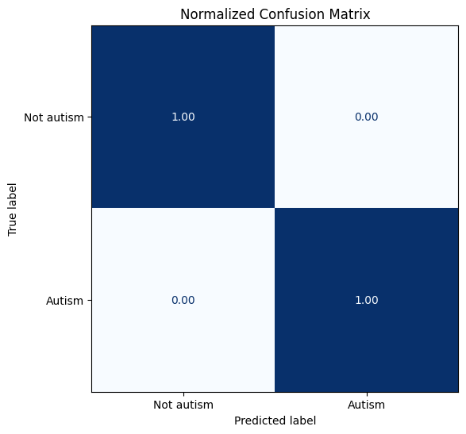
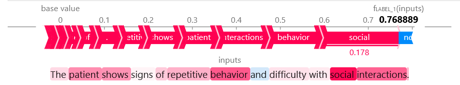

># Diagnosing Autism by Reading Simulated Doctors' Notes
> **by Daniel K Baissa**

## Table of Contents
1. [Set up](#set-up)
2. [Generating Synthetic Data](#generating-synthetic-data)
3. [Reading the notes with a pre-trained Model](#reading-the-notes-with-a-pretrained-model)
4. [Diagnosing Autism with a Classifier](#diagnosing-autism-with-math)
5. [Finetuning the Model](#finetuning) 
6. [Using the Model](#using-the-model)

Autism is a complex medical condition described by certain traits in how the patient interacts with others. On the other hand, doctors document their interactions with patients, which implies that it might be possible to create a transformer model to read the doctor's notes and classify if a patient has Autism. This will be imperfect in practice because the people who write the notes are themselves imperfect reporters, given that they are human. Nonetheless, this might be helpful. Given that medical notes are difficult and expensive to gain and will require IRB approval, I will simulate doctor's notes using a GPT model, then train a model based on the synthetic data to see if it is possible.

### Set up
I will start with some housekeeping. These are some of the packages you will need to import

```python
# Install necessary libraries if not already installed
libraries = ["openai", "transformers", "shap", "torch", "pandas"]

for lib in libraries:
 try:
 __import__(lib)
 except ImportError:
 !pip install {lib}
 __import__(lib)

# Import necessary libraries
import openai
import pandas as pd
import torch
from transformers import BertTokenizer, BertForSequenceClassification, Trainer, TrainingArguments, pipeline
import shap
import os
```

Accessing API Key
```python
openai.api_key = os.getenv("OPENAI_API_KEY")
```
## Generating Synthetic Data

Now that we are logged in, I will simulate the synthetic data. I will use `gpt-3.5-turbo-0125` to generate the data because it is cheap and fast. With funding, GPT-4 would be a better choice. But again, real notes are ideal. 


```python
import openai
import openai
import pandas as pd
from tqdm import tqdm

client = openai.OpenAI()

# Function to generate notes using OpenAI API with chat completions
def generate_notes(content, num_notes):
 notes = []
 for _ in tqdm(range(num_notes), desc="Generating notes"):
 response = client.chat.completions.create(
 model="gpt-3.5-turbo-0125",
 messages=[
 {
 "role": "system",
 "content": content
 },
 {
 "role": "user",
 "content": "Please generate a detailed doctor's note."
 }
 ],
 temperature=0.2,
 top_p=1
 )
 note = response.choices[0].message.content.strip()
 notes.append(note)
 return notes

# Generate autism notes
autism_content = "Write a detailed pediatrician note about a 2 year old patient diagnosed with autism."
autism_notes = generate_notes(autism_content, 1000)

# Generate non-autism notes
non_autism_content = "Write a detailed pediatrician note about a 2 year old patient."
non_autism_notes = generate_notes(non_autism_content, 1000)

# Prepare data for training
df = pd.DataFrame({
 'note': autism_notes + non_autism_notes,
 'label': [1] * len(autism_notes) + [0] * len(non_autism_notes)
})

```

 Generating notes: 100%|██████████████████████████████████████████████████████████| 1000/1000 [1:48:24<00:00,  6.50s/it]
 Generating notes: 100%|██████████████████████████████████████████████████████████| 1000/1000 [1:59:21<00:00,  7.16s/it]
    

Now, the notes are saved in a dataset. This is equivalent to saving them to an Excel sheet with one column named `note` containing the doctors' notes and another column named `label`, which is 1 if they have Autism and 0 otherwise. 

The next step is to split this into training, validation, and test datasets. The reason is to have unused data for out-of-sample testing. We do not care how well our model predicts in sample. A good model should fit extremely well to the data it is trained on. The question is how well it will fit to data it has never seen before. If it can fit to data it is not trained on, then it should hopefully be reasonably accurate in practice. 


```python
import pandas as pd
from sklearn.model_selection import train_test_split
from datasets import Dataset, DatasetDict, ClassLabel


# Split the data into train, validation, and test sets
train_df, temp_df = train_test_split(df, test_size=0.3, random_state=42)
val_df, test_df = train_test_split(temp_df, test_size=0.5, random_state=42)

# Reset the index to avoid '__index_level_0__'
train_df = train_df.reset_index(drop=True)
val_df = val_df.reset_index(drop=True)
test_df = test_df.reset_index(drop=True)

# Define the ClassLabel feature
class_label = ClassLabel(num_classes=2, names=['Not autism', 'Autism'])

# Convert pandas dataframes to Hugging Face datasets and set the ClassLabel feature
def convert_to_dataset(dataframe, class_label):
 dataset = Dataset.from_pandas(dataframe)
 dataset = dataset.cast_column('label', class_label)
 return dataset

train_dataset = convert_to_dataset(train_df, class_label)
val_dataset = convert_to_dataset(val_df, class_label)
test_dataset = convert_to_dataset(test_df, class_label)


# Specify the directory where you want to save the DatasetDict
save_directory = './sim_notes_dataset'

# Save the DatasetDict to the specified directory
sim_notes.save_to_disk(save_directory)

print(f"DatasetDict saved to {save_directory}")
# Print the DatasetDict structure
print(sim_notes)
```


 DatasetDict({
 train: Dataset({
 features: ['note', 'label'],
 num_rows: 1400
 })
 validation: Dataset({
 features: ['note', 'label'],
 num_rows: 300
 })
 test: Dataset({
 features: ['note', 'label'],
 num_rows: 300
 })
 })
    

Above we can see that the training set is saved to `train`, `validation`, and `test` sets. The Training dataset has 1400 obs, with the validation and test sets containing 300. This is typical. It will take more data to fit the model than to test its accuracy. I also saved the data so we don't have to repeatedly pay OpenAI to generate the datasets. 


## Reading the notes with a pretrained Model

Here, we will load the DistilBert checkpoint as a pre-trained model and push it to the GPU if it is available. This should happen automatically, but I want to be sure. 


```python
from transformers import AutoModel
import torch

model_ckpt = "distilbert-base-uncased"
device = torch.device("cuda" if torch.cuda.is_available() else "cpu")
model = AutoModel.from_pretrained(model_ckpt).to(device)
```


### Last hidden state

Next, we will use the Last hidden state from the transformer model to train a simple classifier to predict Autism or not Autism. The hidden state data are basically the data synthesized by the transformer model and covered into variables for regression. However, we need to `tokenize` the words to do that. This is basically turning the words or word stems into numbers so we can perform math on them. Tokenization is a fascinating idea in and of itself. The idea of turning words into numbers in a latent space is really fun, but that is for a different time.  


```python
from transformers import AutoTokenizer

tokenizer = AutoTokenizer.from_pretrained(model_ckpt)

def tokenize(batch):
 texts = batch["note"]
 encoded = tokenizer(texts, padding=True, truncation=True)
 # Return the original text and labels along with the encoded texts
 return {**encoded, "label": batch["label"], "note": batch["note"]}

```

Next, we apply the tokenize function to all notes.

```python
sim_notes_encoded = sim_notes.map(tokenize, batched=True, batch_size=None)
```


```python
print(sim_notes_encoded["train"].column_names)
```

 ['note', 'label', 'input_ids', 'attention_mask']
    

Now we have a dataset that contains the notes, labels, ids, and attention mask, we can finally extract the hidden_states 


```python
def extract_hidden_states(batch):
 # Ensure all data expected to be tensors are actually tensors and then move to device
 inputs = {
 k: torch.tensor(v).to(device) if isinstance(v, list) else v.to(device)
 for k, v in batch.items() if k in tokenizer.model_input_names
 }
 with torch.no_grad():
 last_hidden_state = model(**inputs).last_hidden_state
 return {"hidden_state": last_hidden_state[:, 0].cpu().numpy()}
```


```python
sim_notes_encoded.set_format("torch",
 columns=["input_ids","attention_mask","label"])
```

Again, we are just mapping the function to get the hidden state from each note.

```python
sim_notes_encoded_hidden = sim_notes_encoded.map(extract_hidden_states, batched=True)
```


## Diagnosing Autism with Math

Now that we have access to the hidden_state, we have access to all of the data we need to train a classification model to determine whether a Doctor's note contains language indicative of an Autism Diagnosis. To do this, I will just split the data into our X variables (independent variables) and y data, the outcome (dependent variable). 


```python
import numpy as np

X_train = np.array(sim_notes_encoded_hidden["train"]["hidden_state"])
X_valid = np.array(sim_notes_encoded_hidden["validation"]["hidden_state"])
y_train = np.array(sim_notes_encoded_hidden["train"]["label"]) 
y_valid = np.array(sim_notes_encoded_hidden["validation"]["label"])

X_train.shape, X_valid.shape
```


 ((1400, 768), (300, 768))


Here, we can see that our training data has 768 variables across 1400 observations. This means that each doctor's note is convered into a dataset that contains 768 variables (our independent variables). Now, all that is left to do is fit the data. 

### Train a classifier


```python
from sklearn.linear_model import LogisticRegression 

lr_clf = LogisticRegression(max_iter=3000)
lr_clf.fit(X_train, y_train)
lr_clf.score(X_valid, y_valid)
```


 1.0


We achieved a perfect fit on our first try. This is likely because of the GPT model or its settings. This means that it can predict with 100 percent accuracy whether a patient has Autism or not. In practice, I do not expect this number to be 100%.

### Comparing to dummy classifier


```python
from sklearn.dummy import DummyClassifier

dummy_clf = DummyClassifier(strategy="most_frequent")
dummy_clf.fit(X_train, y_train)
dummy_clf.score(X_valid, y_valid)
```


 0.49


The above is included to see how the model would perform against random "guessing". We had a balanced dataset in this simulated case, so around 50/50 is expected. In practice the data will be less perfect, and this will be more helpful.

The final step before finetuning is to see where the model is failing. To do that, I will use a confusion Matrix. This will tell us a breakdown of how the model does with false positives, true positives, false negatives, and true negatives. 


```python
from sklearn.metrics import ConfusionMatrixDisplay, confusion_matrix
import matplotlib.pyplot as plt

labels = sim_notes["train"].features["label"].names

def plot_confusion_matrix(y_pred, y_true, labels):
 cm=confusion_matrix(y_true, y_preds, normalize="true")
 fig, ax = plt.subplots(figsize=(6,6))
 disp = ConfusionMatrixDisplay(confusion_matrix=cm, display_labels=labels)
 disp.plot(cmap="Blues", values_format=".2f", ax=ax, colorbar=False)
 plt.title("Normalized Confusion Matrix")
 plt.show()

y_preds = lr_clf.predict(X_valid)
plot_confusion_matrix(y_preds, y_valid, labels)
```


    

    


Again, our model had a perfect fit on the data, so there is not much to see here. Still, this is useful. On the y-axis (left-hand side), we know the true label from the synthetic data: Autism or Not Autism. On the x-axis (bottom), we have the predictions made by the model. This is feeding the model a note and having it pick between Autism and Not Autism based. Here, we see it perfectly picked between Autism and Not Autism. In practice, I expect this will be much less accurate. Therefore, I expect we will need to finetune the model.

## Finetuning

Finetuning a model involves starting with a good foundation and then building on top of it. In this case, we will use the same model form above and just train it specifically on the data. Think of it as going from a general pediatrician to getting a subspecialty. I will use accuracy and F1 statistics to generate the metrics to see how well the model is performing. 


```python
from transformers import AutoModelForSequenceClassification

num_labels = 2
model = (AutoModelForSequenceClassification
 .from_pretrained(model_ckpt, num_labels=num_labels)
 .to(device))

from sklearn.metrics import accuracy_score, f1_score

def compute_metrics(pred):
 labels = pred.label_ids
 preds = pred.predictions.argmax(-1)
 f1 = f1_score(labels, preds, average="weighted")
 acc = accuracy_score(labels, preds)
 return {"accuracy": acc, "f1":f1}

```

 Some weights of DistilBertForSequenceClassification were not initialized from the model checkpoint at distilbert-base-uncased and are newly initialized: ['classifier.bias', 'classifier.weight', 'pre_classifier.bias', 'pre_classifier.weight']
 You should probably TRAIN this model on a down-stream task to be able to use it for predictions and inference.
    
The above warning is expected, given that we wanted a flexible model. Thus, not all of its weights were initialized. We will write over them.
I am using the transformers library again for this task. It is from [huggingface](https://huggingface.co/), a leader in open-sourceopen-source AI models and open research. To access some of the features, I will need to log into huggingface using my API key. This will allow me to run gated models and features locally.


```python
import os
api_key = os.getenv("HF_HUB")

from huggingface_hub import login
login(token=api_key)
```

 The token has not been saved to the git credentials helper. Pass `add_to_git_credential=True` in this function directly or `--add-to-git-credential` if using via `huggingface-cli` if you want to set the git credential as well.
 Token is valid (permission: read).
 Your token has been saved to ...
 Login successful
    

Now that I am logged in, all I have to do is finetune the model.


```python
from transformers import Trainer, TrainingArguments

batch_size = 64
logging_steps = len(sim_notes_encoded["train"])//batch_size
model_name = f"{model_ckpt}-finetuned-autism"
training_args = TrainingArguments(output_dir=model_name,
 num_train_epochs=2,
 learning_rate=2e-5,
 per_device_train_batch_size=batch_size,
 per_device_eval_batch_size=batch_size,
 weight_decay=0.01,
 evaluation_strategy="epoch",
 disable_tqdm=False,
 logging_steps=logging_steps,
 push_to_hub=False,
 log_level="error")
```


```python
from transformers import Trainer

trainer = Trainer(model=model, args=training_args,
 compute_metrics=compute_metrics,
 train_dataset=sim_notes_encoded["train"],
 eval_dataset=sim_notes_encoded["validation"],
 tokenizer=tokenizer)

trainer.train();

```

| Epoch | Training Loss | Validation Loss | Accuracy | F1      |
|-------|---------------|-----------------|----------|---------|
| 1     | 0.374500      | 0.105375        | 1.000000 | 1.000000|
| 2     | 0.070500      | 0.039812        | 1.000000 | 1.000000|


### Results from fit

Here, we again see perfect predictions. This is not too surprising, given that is where we started ,
but it limits the model's ability to grow.

```python
preds_output = trainer.predict(sim_notes_encoded["test"])

y_preds = np.argmax(preds_output.predictions, axis=1)
y_test = np.array(sim_notes_encoded_hidden["test"]["label"])


plot_confusion_matrix(y_preds, y_test, labels)
```


    

    


## Using the Model

Now that we have created this model let's use it to "diagnose" some simulated example patients. Here, I will use a single sentence to predict whether the patient has Autism or not.


```python
sentence = "The patient shows signs of repetitive behavior and difficulty with social interactions."
```


```python
import transformers
from transformers import AutoModelForSequenceClassification, AutoTokenizer


model = AutoModelForSequenceClassification.from_pretrained(save_path)
tokenizer = AutoTokenizer.from_pretrained(save_path)
autism_pipeline = transformers.pipeline('text-classification', model=model, tokenizer=tokenizer)
result = autism_pipeline(sentence)[0]
print(result)

```

 {'label': 'LABEL_1', 'score': 0.7688888311386108}
    

Here we see "Label_1" meaning it has indeed identified this text as a person with Autism. It has a score of 0.77, which says its pretty confident but not highly confident they have Autism.

But one might be interested in what words are leading to the decision of the model to classify it as "Autism".


```python
import shap
# explain the model on the input sentence
explainer = shap.Explainer(autism_pipeline) 
shap_values = explainer([sentence])

# visualize the first prediction's explanation for the predicted class
predicted_class = result['label']
shap.plots.text(shap_values[0, :, predicted_class])
```





Here, we can see the breakdown of the Shap values for the prediction. Shap is a concept from game theory that basically describes the cooperation of actors to form a winning coalition. Here, the winning coalition is the words that make the model more likely to predict Autism or not. We can see that `social`, `interactions`, and `behavior` are the words with the greatest impact in this diagnosis. 

In summary, this code is designed to help predict whether a patient has Autism or not simply by reading their notes. It is also designed for future integration with real-world data if they become available. All that would be needed to do is swap the `df` input from the GPT data to real-world data, and it should be possible to run the rest of this code to classify real patient data.

I hope this is helpful,

Dan Baissa