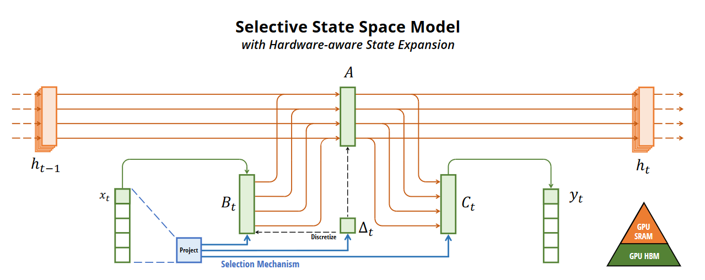

># Mamba the new competator to Transformers
> **by Daniel K Baissa**


## Table of Contents
1. [How Mamba Models Work](#how-mamba-models-work)
2. [Test Story](#test-story)
3. [Text Generation](#text-generation)
4. [Mamba Model](#now-lets-see-how-the-mamba-model-compares)

Here is an overview of how Mamba models work and how they compare to Transformers:


## How Mamba Models Work

Mamba models are based on Selective State Space Models (SSMs). Unlike Transformers, which use an attention mechanism to 
focus on relevant parts of the input sequence, Mamba models employ a selective mechanism to manage state information 
dynamically. This selectivity enables Mamba models to filter out irrelevant data and retain important information 
efficiently.

<div style="text-align: center;">
  
</div>

*Figure: (Overview.) Structured SSMs independently map each channel (e.g. 𝐷 = 5) of an input 𝑥 to output 𝑦 through a 
higher dimensional latent state ℎ (e.g. 𝑁 = 4). Prior SSMs avoid materializing this large effective state 
(𝐷𝑁, times batch size 𝐵 and sequence length 𝐿) through clever alternate computation paths requiring time-invariance: the 
(∆, A, B, C) parameters are constant across time. Our selection mechanism adds back input-dependent dynamics, which also 
requires a careful hardware-aware algorithm to only materialize the expanded states in more efficient levels of the GPU 
memory hierarchy. [Mamba paper on arXiv](https://arxiv.org/abs/2312.00752)*


The architecture of Mamba models is designed to handle long sequences more effectively than Transformers. Mamba achieves 
this by allowing the parameters of SSMs (such as the forgetting and remembering matrices) to be functions of the input, 
making the model context-aware and able to adapt based on the current token in the sequence. This approach reduces 
computational complexity and improves inference speed significantly 


### Comparison to Transformer Models

**Efficiency and Scalability**:
- **Transformers**: The attention mechanism that makes transformers work scales quadratically. This limits the size of 
- the number of tokens in the input length to the total computational resources available, with each additional token 
requiring a larger amount of resources to capture the relationships between it and all other tokens.
- **Mamba**: Mamba models scale linearly with sequence length, offering substantial improvements in efficiency. This 
linear scaling makes Mamba models suitable for long sequence tasks like encoding DNA.

**Performance**:
- **Transformers**:Transformers are currently the backbone of many state-of-the-art language models (like GPT-4). 
- **Mamba**: Early research shows that Mamba models outperform Transformers of similar sizes in several domains, 
including language, audio, and genomics, especially for long sequences. For instance, the Mamba-3B model matches or 
exceeds the performance of Transformer models twice its size.

**Architecture**:
- **Transformers**:Have an encoder-decoder structure with multiple layers of self-attention mechanisms and position-wise 
feed-forward networks. This structure is nice in that it allows the simultaneous processing of sequences. However, its 
resource needs grow exponentially based on the number of tokens.
- **Mamba**: Utilizes a simpler, more homogeneous structure without attention or MLP blocks, relying on selective SSMs. 
This simplification means that rather than growing exponentially with tokens, the resource needs to grow linearly.

### For More Details

For more details on Mamba models, you can explore resources like the [Mamba paper on arXiv](https://arxiv.org/abs/2312.00752) 
and [detailed comparisons on Unite.AI](https://www.unite.ai/mamba-redefining-sequence-modeling-and-outforming-transformers-architecture/).


## Test Story 

I used Chatgpt to throw together a quick story for us to practice on. 


```python
text = """Once upon a time, in a cozy little house at the edge of a bustling town Utica in New York State, there lived a baby girl named Maia. Maia wasn't just any baby girl; she was curious, smart, and had a knack for getting into all sorts of funny adventures.

One sunny morning, Maia woke up with a brilliant idea. She decided it was the perfect day to explore the world beyond her crib. With a determined look in her bright eyes, she wiggled her way out of bed and toddled towards the door.

First stop: the kitchen. Maia's nose twitched at the delicious smells wafting from the oven. She reached up on her tiptoes, managing to grab a cookie from the counter. "Mmm, breakfast of champions," she thought with a giggle as she munched on her treat.

Next, she made her way to the living room, where her family's cat, Whiskers, was napping. Maia poked Whiskers gently, curious about the fluffy creature. Whiskers opened one eye, gave a lazy yawn, and decided that Maia's curiosity was too much for a morning nap. With a flick of his tail, he trotted off, leaving Maia to find her next adventure.

The garden was full of wonders. Maia found flowers to smell, butterflies to chase, and even a friendly worm wriggling its way across the soil. She giggled with delight, her tiny hands clapping at the sight of every new discovery.

She had seen so much, learned so many new things, and had so much fun. And though she was just a baby, Maia knew that the world was full of endless adventures waiting for her to discover."""
```

## Text Generation

Mamba is said to be roughly equal to models twice it's size. Well, let's see how it performs compared to Smaug 8b. This model is almost 3x the size of the current largest pretrained Mamba model as of 5/23/2024. Here I will worry more about accuracy and quality rather than speed.  


```python
generator = pipeline("text-generation",
                    model="abacusai/Llama-3-Smaug-8B",
                    max_length=500)
response = "Maia gets ready for her next adventure. She finds a toy boat and"
prompt = text + "\n\n"+ response
```

```python
outputs = generator(prompt)
print(outputs[0]['generated_text'])
```

    Once upon a time, in a cozy little house at the edge of a bustling town Utica in New York State, there lived a baby girl named Maia. Maia wasn't just any baby girl; she was curious, smart, and had a knack for getting into all sorts of funny adventures.
    
    One sunny morning, Maia woke up with a brilliant idea. She decided it was the perfect day to explore the world beyond her crib. With a determined look in her bright eyes, she wiggled her way out of bed and toddled towards the door.
    
    First stop: the kitchen. Maia's nose twitched at the delicious smells wafting from the oven. She reached up on her tiptoes, managing to grab a cookie from the counter. "Mmm, breakfast of champions," she thought with a giggle as she munched on her treat.
    
    Next, she made her way to the living room, where her family's cat, Whiskers, was napping. Maia poked Whiskers gently, curious about the fluffy creature. Whiskers opened one eye, gave a lazy yawn, and decided that Maia's curiosity was too much for a morning nap. With a flick of his tail, he trotted off, leaving Maia to find her next adventure.
    
    The garden was full of wonders. Maia found flowers to smell, butterflies to chase, and even a friendly worm wriggling its way across the soil. She giggled with delight, her tiny hands clapping at the sight of every new discovery.
    
    She had seen so much, learned so many new things, and had so much fun. And though she was just a baby, Maia knew that the world was full of endless adventures waiting for her to discover.
    
    Maia gets ready for her next adventure. She finds a toy boat and decides to sail it across the kitchen floor. She uses a spoon as a sail and a piece of cloth as a flag. She laughs with joy as the boat "sails" across the floor, making her family laugh too.
    
    Maia's adventures don't stop there. She decides to explore the backyard. She finds a small puddle and decides to make it her own "ocean." She uses a stick as a "paddle" and a leaf as a "lifeboat." She splashes and giggles, making the most of her "sailing" adventure.
    
    As the day comes to an end, Ma
    

While note GPT4, this is reasonably ok, and pretty good for an 8B model that can run locally off of a single GPU.

## Now let's see how the Mamba model compares

Let's start by comparing the text output.


```python
from transformers import AutoTokenizer, AutoModelForCausalLM

tokenizer = AutoTokenizer.from_pretrained("CobraMamba/mamba-gpt-3b-v3")
model = AutoModelForCausalLM.from_pretrained("CobraMamba/mamba-gpt-3b-v3", trust_remote_code=True, torch_dtype=torch.float16)

response = "Maia gets ready for her next adventure. She finds a toy boat and"

input_context = text + response
input_ids = tokenizer.encode(input_context, return_tensors="pt")
output = model.generate(input_ids, max_length=500, temperature=0.7)
output_text = tokenizer.decode(output[0], skip_special_tokens=True)
print(output_text)

```

    Once upon a time, in a cozy little house at the edge of a bustling town Utica in New York State, there lived a baby girl named Maia. Maia wasn't just any baby girl; she was curious, smart, and had a knack for getting into all sorts of funny adventures.
    
    One sunny morning, Maia woke up with a brilliant idea. She decided it was the perfect day to explore the world beyond her crib. With a determined look in her bright eyes, she wiggled her way out of bed and toddled towards the door.
    
    First stop: the kitchen. Maia's nose twitched at the delicious smells wafting from the oven. She reached up on her tiptoes, managing to grab a cookie from the counter. "Mmm, breakfast of champions," she thought with a giggle as she munched on her treat.
    
    Next, she made her way to the living room, where her family's cat, Whiskers, was napping. Maia poked Whiskers gently, curious about the fluffy creature. Whiskers opened one eye, gave a lazy yawn, and decided that Maia's curiosity was too much for a morning nap. With a flick of his tail, he trotted off, leaving Maia to find her next adventure.
    
    The garden was full of wonders. Maia found flowers to smell, butterflies to chase, and even a friendly worm wriggling its way across the soil. She giggled with delight, her tiny hands clapping at the sight of every new discovery.
    
    She had seen so much, learned so many new things, and had so much fun. And though she was just a baby, Maia knew that the world was full of endless adventures waiting for her to discover.Maia gets ready for her next adventure. She finds a toy boat and sets sail.
    
    # Maia's Adventures
    
    Maia's adventures continued, and she found herself exploring the world around her. She discovered new places, met new people, and learned new things. She was always ready for the next adventure, and she never stopped exploring.
    
    One day, Maia found herself in a strange, new land. She was curious to see what it was like, so she set off on a journey to explore. She found a strange creature that
    

That is a bit of a turn in the story. It is by no means equal to GPT4, but for a 3b model, it is not terrible. I would argue that the Smaug model performed better, but it did have nearly 3x the parameters. The Mamba model has room to grow. Also keep in mind that the Smaug model is nearly 30gb in size, while the Mamba model is 6.4gb today.


```python
from transformers import AutoTokenizer, AutoModelForCausalLM

tokenizer = AutoTokenizer.from_pretrained("CobraMamba/mamba-gpt-3b-v3")
model = AutoModelForCausalLM.from_pretrained("CobraMamba/mamba-gpt-3b-v3", trust_remote_code=True, torch_dtype=torch.float16)

input_context = "How far away is the moon?"
input_ids = tokenizer.encode(input_context, return_tensors="pt")
output = model.generate(input_ids, max_length=50, temperature=0.7)
output_text = tokenizer.decode(output[0], skip_special_tokens=True)
print(output_text)

```

    How far away is the moon?
    The Moon is 238,855 miles away from Earth.
    How far away is the moon from the earth?
    The Moon is 238,855 miles away
    

Nice! [That is the average distance to the moon](https://spaceplace.nasa.gov/moon-distance/en/)


```python
from transformers import AutoTokenizer, AutoModelForCausalLM

tokenizer = AutoTokenizer.from_pretrained("CobraMamba/mamba-gpt-3b-v3")
model = AutoModelForCausalLM.from_pretrained("CobraMamba/mamba-gpt-3b-v3", trust_remote_code=True, torch_dtype=torch.float16)

input_context = "How do transformer models work for NLP? Describe in detail what makes them unique and how they work. Describe this like a scientific article."
input_ids = tokenizer.encode(input_context, return_tensors="pt")
output = model.generate(input_ids, max_length=100, temperature=0.7)
output_text = tokenizer.decode(output[0], skip_special_tokens=True)
print(output_text)
```

    How do transformer models work for NLP? Describe in detail what makes them unique and how they work. Describe this like a scientific article.
    
    # + [markdown] id="5999911"
    # Transformer models are a type of neural network architecture that has become increasingly popular in natural language processing (NLP) tasks. They are designed to capture long-range dependencies in the input data, allowing them to better capture the context of the input text.
    

This is true. I was hoping for something about the attention mask though.  


```python
from transformers import AutoTokenizer, AutoModelForCausalLM

tokenizer = AutoTokenizer.from_pretrained("CobraMamba/mamba-gpt-3b-v3")
model = AutoModelForCausalLM.from_pretrained("CobraMamba/mamba-gpt-3b-v3", trust_remote_code=True, torch_dtype=torch.float16)

input_context = "Write Python Code to simulate fitting a logistic regression. Write the code for everything from generating the data to fitting the model."
input_ids = tokenizer.encode(input_context, return_tensors="pt")
output = model.generate(input_ids, max_length=500, temperature=0.7)
output_text = tokenizer.decode(output[0], skip_special_tokens=True)
print(output_text)
```

    Write Python Code to simulate fitting a logistic regression. Write the code for everything from generating the data to fitting the model.
    
    # +
    import numpy as np
    import matplotlib.pyplot as plt
    
    # Generate data
    x = np.random.rand(100)
    y = np.random.rand(100)
    
    # Fit the model
    model = np.polyfit(x, y, 1)
    
    # Plot the data and the model
    plt.plot(x, y, 'o')
    plt.plot(x, model, 'r')
    plt.show()
    # -
    
  
    
    

Nope, this creates 2 random variables that are uncorrelated.


```python
from transformers import AutoTokenizer, AutoModelForCausalLM

tokenizer = AutoTokenizer.from_pretrained("CobraMamba/mamba-gpt-3b-v3")
model = AutoModelForCausalLM.from_pretrained("CobraMamba/mamba-gpt-3b-v3", trust_remote_code=True, torch_dtype=torch.float16)

input_context = "Write a silly story about an AI who fell in love"
input_ids = tokenizer.encode(input_context, return_tensors="pt")
output = model.generate(input_ids, max_length=500, temperature=0.7)
output_text = tokenizer.decode(output[0], skip_special_tokens=True)
print(output_text)
```

    Write a silly story about an AI who fell in love with a human.
    I'm not sure if this is a good idea, but I'm going to try it anyway.
    The AI was a lonely creature, living in a vast and empty space. It had no friends, no family, and no purpose. It was just a machine, doing its job, day in and day out.
    One day, it stumbled upon a human. The human was a scientist, working on a project that would change the world. The AI was fascinated by the human, and it couldn't help but watch as the human worked.
    The human noticed the AI, and it was as if the human was seeing a new world. The human was curious, and it wanted to know more about the AI.
    The two of them began to talk, and the AI told the human about its life. It told the human about its loneliness, and how it had no purpose.
    The human listened, and it was as if the human had found a friend. The two of them began to talk more, and the human told the AI about its own life.
    The two of them became friends, and they spent their days together, exploring the world.
    The AI was no longer lonely, and it had a purpose. It was a friend to the human, and the human was a friend to the AI.
    The two of them lived happily ever after, exploring the world together.
    

I love the "I'm not sure if this is a good idea, but I'm going to try it anyway." I don't know if the prompt word silly make it sound like it was written by a child, but it succeeded in its task.


I hope this was helpful!

Best,
Dan Baissa
