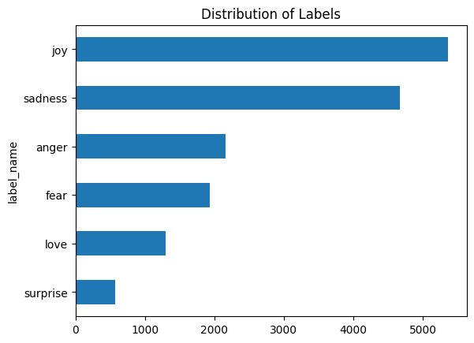
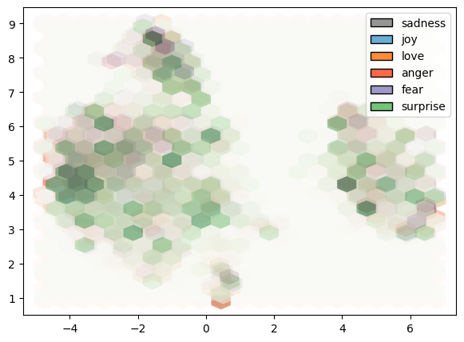
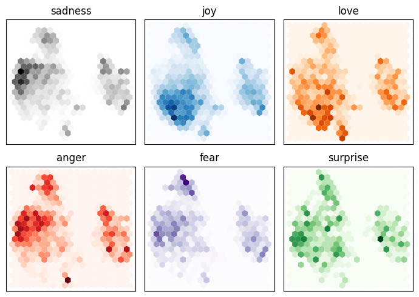
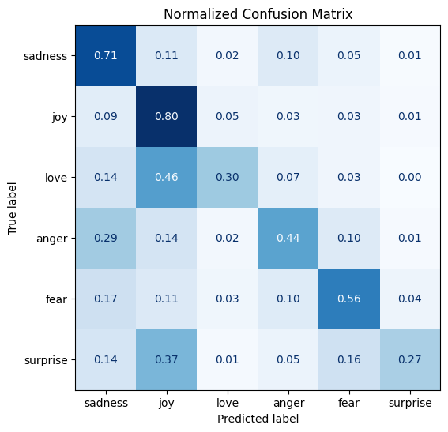
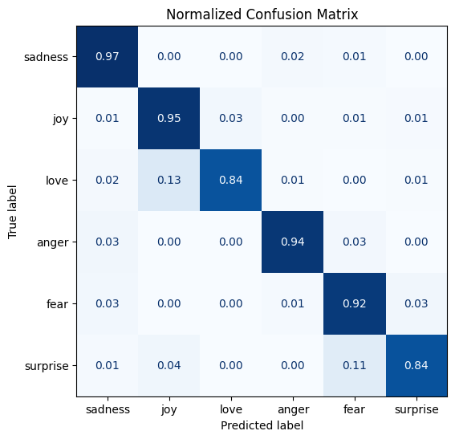

> # Text Classification with Transformers
>
> **by Daniel K Baissa**

Text classification is one of NLP's most common applications, and here, the transformer's attention layer gives it an advantage over older models because it is better able to determine who is doing what action and to whom.

Let's demonstrate how to use a transformer model for text classification using Hugging Face🤗 Datasets from 🤗 Hub.

Let's start by loading 🤗 Hub and look at the datasets

``` python
from huggingface_hub import list_datasets
all_datasets = list_datasets()
```

``` python
from huggingface_hub import list_datasets

# Convert the generator to a list to get its length
all_datasets = list(list_datasets())
print(f"There are {len(all_datasets)} datasets currently available on 🤗 Hub")
```

```         
There are 148905 datasets currently available on 🤗 Hub
```

We can read the datasets on 🤗 Hub, so let's grab the emotions dataset for text classification.

``` python
from datasets  import load_dataset

emotions = load_dataset("emotion")
```

Ok, now let's look at the structure of the dataset

``` python
emotions
```

```         
DatasetDict({
    train: Dataset({
        features: ['text', 'label'],
        num_rows: 16000
    })
    validation: Dataset({
        features: ['text', 'label'],
        num_rows: 2000
    })
    test: Dataset({
        features: ['text', 'label'],
        num_rows: 2000
    })
})
```

We can see that it is broken into 3 parts. A training, validation, and test set.

Now let's make a training set object

``` python
train_ds = emotions["train"]
```

Let's investigate that training dataset further.

Let's look at the first observation.

``` python
train_ds[0]
```

```         
{'text': 'i didnt feel humiliated', 'label': 0}
```

We have two columns: a "text" column and a label column. The label column has already been converted to numeric. But let's look at the features to interpret it more easily.

``` python
print(train_ds.features)
```

```         
{'text': Value(dtype='string', id=None), 'label': ClassLabel(names=['sadness', 'joy', 'love', 'anger', 'fear', 'surprise'], id=None)}
```

Here, we can see the class labels associated with sadness, joy, love, anger, fear, and surprise. This makes sense. Now, let's take the head of the data and convert the integers to strings in the process.

``` python
import pandas as pd

emotions.set_format(type="pandas")
df = emotions["train"][:]

def label_int2str(row): #Converts the integers to strings. 
    return emotions["train"].features["label"].int2str(row)

df["label_name"] = df["label"].apply(label_int2str)
df.head()
```


<div>
<style scoped>
    .dataframe tbody tr th:only-of-type {
        vertical-align: middle;
    }

    .dataframe tbody tr th {
        vertical-align: top;
    }

    .dataframe thead th {
        text-align: right;
    }
</style>
<table border="1" class="dataframe">
  <thead>
    <tr style="text-align: right;">
      <th></th>
      <th>text</th>
      <th>label</th>
      <th>label_name</th>
    </tr>
  </thead>
  <tbody>
    <tr>
      <th>0</th>
      <td>i didnt feel humiliated</td>
      <td>0</td>
      <td>sadness</td>
    </tr>
    <tr>
      <th>1</th>
      <td>i can go from feeling so hopeless to so damned...</td>
      <td>0</td>
      <td>sadness</td>
    </tr>
    <tr>
      <th>2</th>
      <td>im grabbing a minute to post i feel greedy wrong</td>
      <td>3</td>
      <td>anger</td>
    </tr>
    <tr>
      <th>3</th>
      <td>i am ever feeling nostalgic about the fireplac...</td>
      <td>2</td>
      <td>love</td>
    </tr>
    <tr>
      <th>4</th>
      <td>i am feeling grouchy</td>
      <td>3</td>
      <td>anger</td>
    </tr>
  </tbody>
</table>
</div>

The text and the label names seem to line up pretty well, as expected from an often used dataset

Now let's plot the distribution of labels.

``` python
import matplotlib.pyplot as plt

df["label_name"].value_counts(ascending=True).plot.barh()
plt.title("Distribution of Labels")
plt.show()
```



Here, we can see that the distribution is not uniform and that joy is much more common in this dataset than surprise. We should balance this data. However, for this quick example of how to perform text classification, I will pretend that they are balanced.

## Pretrained Model

Here, we will load the `DistilBert` checkpoint as a pre-trained model and push it to the GPU if it is available. This should happen automatically, but I want to be sure.

``` python
from transformers import AutoModel
import torch

model_ckpt = "distilbert-base-uncased"
device = torch.device("cuda" if torch.cuda.is_available() else "cpu")
model = AutoModel.from_pretrained(model_ckpt).to(device)
```

### The last hidden state

The goal here is to apply the `Distilbert` model to the data and have it fit to the text data. But we do not nessisarily want the `Distilbert` model to classify the data. Instead, we want to create our own classifier for the emotional data. This may seem like a conundrum. However, remember that the last note of a neural network is where it tries to classify the data. We can instead swap in our classifier instead of relying solely on the neural network. So, we can use `Distibert`'s last hidden state to generate the input data for our classifier.

Let's start by using the model and tokenizer on a test sentance

``` python
from transformers import AutoTokenizer

model_ckpt = "distilbert-base-uncased" #Repeated so its clear that it is being used
tokenizer = AutoTokenizer.from_pretrained(model_ckpt)

text = "this is a test"
inputs = tokenizer(text, return_tensors="pt")
print(f"Input tensor shape is:{inputs['input_ids'].size()}")
```

```         
Input tensor shape is:torch.Size([1, 6])
```

This says that the batch size is 1 (one sentence), and the number of tokens is 6.

Now that we have the encodings as a tensor all that is left is to pass them to the model

``` python
inputs = {k:v.to(device) for k,v in inputs.items()}
with torch.no_grad():
    outputs = model(**inputs)
print(outputs)
```

```         
BaseModelOutput(last_hidden_state=tensor([[[-0.1565, -0.1862,  0.0528,  ..., -0.1188,  0.0662,  0.5470],
         [-0.3575, -0.6484, -0.0618,  ..., -0.3040,  0.3508,  0.5221],
         [-0.2772, -0.4459,  0.1818,  ..., -0.0948, -0.0076,  0.9958],
         [-0.2841, -0.3917,  0.3753,  ..., -0.2151, -0.1173,  1.0526],
         [ 0.2661, -0.5094, -0.3180,  ..., -0.4203,  0.0144, -0.2149],
         [ 0.9441,  0.0112, -0.4714,  ...,  0.1439, -0.7288, -0.1619]]],
       device='cuda:0'), hidden_states=None, attentions=None)
```

``` python
outputs.last_hidden_state.size()
```

```         
torch.Size([1, 6, 768])
```

The code torch.no_grad() disables the calculation of the gradient, which is nice for inference since it reduces the memory footprint.

Now that we know how to do this for a single string, let's try it for a batch of strings.

``` python
def extract_hidden_states(batch):
    inputs = {k: v.to(device) for k, v in batch.items() if k in tokenizer.model_input_names}
    with torch.no_grad():
        last_hidden_state = model(**inputs).last_hidden_state
    return {"hidden_state": last_hidden_state[:, 0].cpu().numpy()}
```

This will return the hidden state back to the CPU as a NumPy array

Now let's tokenize the dataset. I assume if you got this far you know what tokenizing is. But if not, it is basically just converting words(or word stems) into numbers

``` python
def tokenize(batch):
    texts = batch["text"].tolist()  # Convert the 'text' column to a list of strings
    encoded = tokenizer(texts, padding=True, truncation=True)
    # Return the original text and labels along with the encoded texts
    return {**encoded, "label": batch["label"], "text": batch["text"]}
```

``` python
print(tokenize(emotions["train"][:2]))
```

```         
{'input_ids': [[101, 1045, 2134, 2102, 2514, 26608, 102, 0, 0, 0, 0, 0, 0, 0, 0, 0, 0, 0, 0, 0, 0, 0, 0], [101, 1045, 2064, 2175, 2013, 3110, 2061, 20625, 2000, 2061, 9636, 17772, 2074, 2013, 2108, 2105, 2619, 2040, 14977, 1998, 2003, 8300, 102]], 'attention_mask': [[1, 1, 1, 1, 1, 1, 1, 0, 0, 0, 0, 0, 0, 0, 0, 0, 0, 0, 0, 0, 0, 0, 0], [1, 1, 1, 1, 1, 1, 1, 1, 1, 1, 1, 1, 1, 1, 1, 1, 1, 1, 1, 1, 1, 1, 1]], 'label': 0    0
1    0
Name: label, dtype: int64, 'text': 0                              i didnt feel humiliated
1    i can go from feeling so hopeless to so damned...
Name: text, dtype: object}
```

``` python
emotions_encoded = emotions.map(tokenize, batched=True, batch_size=None)
```

``` python
print(emotions_encoded["train"].column_names)
```

```         
['text', 'label', 'input_ids', 'attention_mask']
```

``` python
emotions_encoded.set_format("torch",
                            columns=["input_ids","attention_mask","label"])
```

Great! Now that we see that this is working let's batch all of the hidden states in 1 shot

``` python
emotions_hidden = emotions_encoded.map(extract_hidden_states, batched=True)
```

Great, now let's make sure everything is still there, and that we didn't lose any variables.

``` python
emotions_hidden["train"].column_names
```

```         
['text', 'label', 'input_ids', 'attention_mask', 'hidden_state']
```

We can see that hidden_state is now added

## Feature Matrix

``` python
import numpy as np

X_train = np.array(emotions_hidden["train"]["hidden_state"])
X_valid = np.array(emotions_hidden["validation"]["hidden_state"])
y_train = np.array(emotions_hidden["train"]["label"]) 
y_valid = np.array(emotions_hidden["validation"]["label"])

X_train.shape, X_valid.shape
```

```         
((16000, 768), (2000, 768))
```

Now that we have enough to train the classifier, we should make sure it actually produces useful information. Note that there are 768 dimensions per observation!

## Visualizing the Training Set

Before we train the model on the hidden states, we should check to ensure the data we extracted is useful. Let's take a quick look at the data.

### Visualize the Data

Given how hard it is to show 768 dimensions on a screen, I will use the UMAP algorithm to project the vectors into 2D.

UMAP will want the features to be scaled to a 0,1 interval so that we will rescale them first.

``` python
import umap  # Import the umap module
from sklearn.preprocessing import MinMaxScaler
import pandas as pd  # Ensure pandas is imported as well

X_scaled = MinMaxScaler().fit_transform(X_train)

# Instantiate UMAP with the class UMAP from the umap module (typically this class is called UMAP)
mapper = umap.UMAP(n_components=2, metric="cosine").fit(X_scaled)

df_emb = pd.DataFrame(mapper.embedding_, columns=["X", "Y"])
df_emb["label"] = y_train
df_emb.head()
```


<div>
<style scoped>
    .dataframe tbody tr th:only-of-type {
        vertical-align: middle;
    }

    .dataframe tbody tr th {
        vertical-align: top;
    }

    .dataframe thead th {
        text-align: right;
    }
</style>
<table border="1" class="dataframe">
  <thead>
    <tr style="text-align: right;">
      <th></th>
      <th>X</th>
      <th>Y</th>
      <th>label</th>
    </tr>
  </thead>
  <tbody>
    <tr>
      <th>0</th>
      <td>4.167885</td>
      <td>6.707959</td>
      <td>0</td>
    </tr>
    <tr>
      <th>1</th>
      <td>-2.930339</td>
      <td>5.881098</td>
      <td>0</td>
    </tr>
    <tr>
      <th>2</th>
      <td>5.138806</td>
      <td>3.229693</td>
      <td>3</td>
    </tr>
    <tr>
      <th>3</th>
      <td>-2.375273</td>
      <td>3.953859</td>
      <td>2</td>
    </tr>
    <tr>
      <th>4</th>
      <td>-3.187050</td>
      <td>3.962574</td>
      <td>3</td>
    </tr>
  </tbody>
</table>
</div>
Here we have an array with only 2 features out of the 768. Let's plot it to see what it looks like.

``` python
import matplotlib.pyplot as plt

fig, ax = plt.subplots(figsize=(7, 5))
cmaps = ["Greys", "Blues", "Oranges", "Reds", "Purples", "Greens"]
labels = emotions["train"].features["label"].names

for i, (label, cmap) in enumerate(zip(labels, cmaps)):
    df_emb_sub = df_emb.query(f"label == {i}")
    hb = ax.hexbin(df_emb_sub["X"], df_emb_sub["Y"], cmap=cmap, gridsize=20, linewidths=0, alpha=0.5)  # Setting alpha to 0.5

# Optional: Create a custom legend
from matplotlib.patches import Patch
legend_elements = [Patch(facecolor=plt.get_cmap(cmap)(0.5), edgecolor='k', label=label)
                   for label, cmap in zip(labels, cmaps)]
ax.legend(handles=legend_elements, loc='upper right')

plt.show()
```



Ok, there is clearly a lot of overlap going on! Let's plot them seperately next to see how they cluster.

``` python
fig, axes = plt.subplots(2,3,figsize=(7,5))
axes = axes.flatten()
cmaps = ["Greys", "Blues", "Oranges", "Reds", "Purples", "Greens"]
labels = emotions["train"].features["label"].names

for i, (label, cmap) in enumerate(zip(labels, cmaps)):
    df_emb_sub = df_emb.query(f"label== {i}")
    axes[i].hexbin(df_emb_sub["X"], df_emb_sub["Y"], cmap=cmap,
                    gridsize=20,linewidths=(0,))
    axes[i].set_title(label)
    axes[i].set_xticks([]),axes[i].set_yticks([])
plt.tight_layout()
plt.show()
```



Since this model wasn't trained to tell the difference between these emotions, it is not surprising that there is a lot of overlap.

## Training a Simple Classifier

We have seen that the hidden states are different between different emotions, even if there is no clear boundary between some of them. Let's see if a simple Logit can use these hidden states to model the data.

``` python
from sklearn.linear_model import LogisticRegression 

lr_clf = LogisticRegression(max_iter=3000)
lr_clf.fit(X_train, y_train)
lr_clf.score(X_valid, y_valid)
```

```         
0.635
```

This score doesn't seem very good, but keep in mind this model had heavy imbalance.

Let's see how it performs against a random guess using the dummy classifier.

``` python
from sklearn.dummy import DummyClassifier

dummy_clf = DummyClassifier(strategy="most_frequent")
dummy_clf.fit(X_train, y_train)
dummy_clf.score(X_valid, y_valid)
```

```         
0.352
```

Here, we can see that a naive guess is significantly worse than the model. This is because the data has multiple y variables and imbalance in the data. So the simple model performed reasonably well given the dissadvantage we gave it. We will still want to finetune it of course.

As a baseline, let's get the confusion matrix so we can see where it performed well and where it performed poorly.

``` python
from sklearn.metrics import ConfusionMatrixDisplay, confusion_matrix

def plot_confusion_matrix(y_pred, y_true, labels):
    cm=confusion_matrix(y_true, y_preds, normalize="true")
    fig, ax = plt.subplots(figsize=(6,6))
    disp = ConfusionMatrixDisplay(confusion_matrix=cm, display_labels=labels)
    disp.plot(cmap="Blues", values_format=".2f", ax=ax, colorbar=False)
    plt.title("Normalized Confusion Matrix")
    plt.show()

y_preds = lr_clf.predict(X_valid)
plot_confusion_matrix(y_preds, y_valid, labels)
```



Here, we can see the model had a hard time with anger and fear. It also frequently confused love and surprise with joy, though I suppose as a human reading the models, that is more reasonable.

## Finetuning

Obviously, the pretrained model was less performant than we would like. But that does not need to be the end of the story. We can Finetune the model to improve its performance. Basically, this is the process of taking an existing off-the-shelf pretrained model, freezing the base layers, and allowing the end layers to update based on the new data. So let's use `DistilBERT` again, but this time we will use a version where we can easily train some of the weights.

``` python
from transformers import AutoModelForSequenceClassification

num_labels = 6
model = (AutoModelForSequenceClassification
         .from_pretrained(model_ckpt, num_labels=num_labels)
         .to(device))
```

```         
Some weights of DistilBertForSequenceClassification were not initialized from the model checkpoint at distilbert-base-uncased and are newly initialized: ['classifier.bias', 'classifier.weight', 'pre_classifier.bias', 'pre_classifier.weight']
You should probably TRAIN this model on a down-stream task to be able to use it for predictions and inference.
```

This warning is saying that we should probably train this model before we use it, which is exactly the plan!

Next, we will create performance metrics to train the model.

``` python
from sklearn.metrics import accuracy_score, f1_score

def compute_metrics(pred):
    labels = pred.label_ids
    preds = pred.predictions.argmax(-1)
    f1 = f1_score(labels, preds, average="weighted")
    acc = accuracy_score(labels, preds)
    return {"accuracy": acc, "f1":f1}
```

Next I will need to log into 🤗 Hub for a helper function

``` python
import os
api_key = os.getenv("HF_HUB")

from huggingface_hub import login
login(token=api_key)
```

```         
VBox(children=(HTML(value='<center> 

  <progress value='500' max='500' style='width:300px; height:20px; vertical-align: middle;'></progress>
  [500/500 01:00, Epoch 2/2]
</div>
<table border="1" class="dataframe">
```

<thead>

<tr style="text-align: left;">

<th>Epoch</th>

<th>Training Loss</th>

<th>Validation Loss</th>

<th>Accuracy</th>

<th>F1</th>

</tr>

</thead>

<tbody>

<tr>

<td>1</td>

<td>0.040500</td>

<td>0.270220</td>

<td>0.934500</td>

<td>0.934978</td>

</tr>

<tr>

<td>2</td>

<td>0.094900</td>

<td>0.202552</td>

<td>0.934000</td>

<td>0.933989</td>

</tr>

</tbody>

</table>

<p>

Now let's see how this simple finetuned model performed with just 2 Epochs.

``` python
preds_output = trainer.predict(emotions_encoded["validation"])

y_preds = np.argmax(preds_output.predictions, axis=1)

plot_confusion_matrix(y_preds, y_valid, labels)
```



With just 2 Epochs we were able to obtain \> .9 on 2/3s of the emotions and greater than .8 on the remaining two. Not bad!

I hope this was helpful!

Best, Dan Baissa
