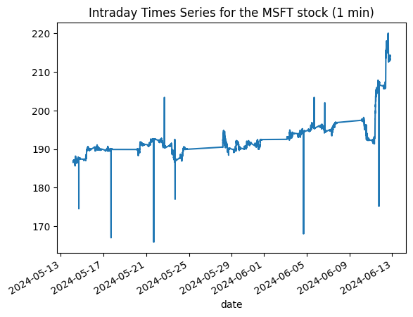

># Stock Price Prediction Using Transformer Models
> **by Daniel K Baissa**

Understanding and predicting stock prices is a complex challenge that has captivated economists, data scientists, and investors alike. The financial market data, much like natural language, is inherently sequential. This similarity sparked my interest in applying advanced Natural Language Processing (NLP) techniques to time series forecasting. Specifically, I was intrigued by the potential of transformer models, which have revolutionized NLP, to enhance our ability to predict stock prices.

At its core, NLP deals with sequences of words and sentences, which can be viewed as a form of time series data. Each word or token in a sentence depends on the ones that come before it, creating a chain of dependencies that the model must understand. Similarly, stock prices at a given time point depend on previous prices, making the task of predicting them analogous to predicting the next word in a sentence.

### Why Transformer Models?

Transformer models, with their attention mechanisms, excel in capturing these dependencies. The attention mask in transformer models allows them to focus on relevant parts of the input sequence, identifying and leveraging patterns that simpler models might miss. This capability makes them exceptionally suited for time series analysis, where understanding the influence of past events on future outcomes is crucial.

Transformers have emerged as a powerful tool in NLP due to their ability to handle long-range dependencies and parallelize training, which significantly reduces computation time. The key component of a transformer is the attention mechanism, which assigns different weights to different parts of the input data, enabling the model to focus on the most relevant information. This makes transformers particularly effective in tasks where context is critical, such as language translation and text generation.

Applying this to time series data, the transformer's ability to attend to various time steps and capture intricate patterns offers a promising approach to stock price prediction. Unlike traditional models that might struggle with long sequences, transformers can efficiently manage and make sense of extensive historical data, providing more accurate and insightful predictions.

### Overview of This Notebook

In this notebook, we will explore the application of transformer models to stock price prediction. Here’s the roadmap for our journey:

1. **Data Retrieval and Preparation**: We'll start by fetching intraday stock data using the Alpha Vantage API and preparing it for analysis.
2. **Exploratory Data Analysis**: A brief exploration to understand the structure and characteristics of our data.
3. **Model Construction**: We'll build a transformer-based model designed to predict future stock prices based on historical data.
4. **Model Evaluation**: After training our model, we’ll evaluate its performance using the RMSE metric to gauge its predictive accuracy.
5. **Comparison with ARIMA**: To benchmark our transformer model, we'll compare its performance with a traditional ARIMA model, highlighting the strengths of the transformer approach.
6. **Conclusion and Future Directions**: We’ll wrap up with insights from our experiment and discuss potential enhancements, such as incorporating cross-sectional data for even better predictions.

Let's dive into this experiment and see how well transformers can predict the ebbs and flows of the stock market!


## Data Retrieval

Before we dive into the intricacies of predicting stock prices, let's set up our environment by pulling in some necessary Python libraries. We'll need requests and pandas for handling data, and matplotlib for plotting:

```python
import requests
import pandas as pd
import matplotlib.pyplot as plt
```

Now, let’s grab some real-time stock data using the Alpha Vantage API. We'll use the TimeSeries class to fetch one-minute interval data for Apple Inc. (symbol: AAPL). After retrieving the data, we'll plot the closing prices to get a visual sense of recent trends:

```python
from alpha_vantage.timeseries import TimeSeries
import matplotlib.pyplot as plt

ts = TimeSeries(key='YOUR_API_KEY', output_format='pandas')
data, meta_data = ts.get_intraday(symbol='AAPL',interval='1min', outputsize='full')
data['4. close'].plot()
plt.title('Intraday Times Series for the MSFT stock (1 min)')
plt.show()
```


    

    
In this plot, we can observe how the stock price fluctuates throughout the day. This visualization is crucial as it sets the stage for our next steps—predicting future price movements.

#### Understanding Our Data

Having fetched the data, let's take a moment to understand the structure of our dataset. Here’s how our data appears when we print it out. This table is not just numbers; it represents the heartbeat of the market, with each row capturing the stock's performance at one-minute intervals:

```python
data
```


<div>
<style scoped>
    .dataframe tbody tr th:only-of-type {
        vertical-align: middle;
    }

    .dataframe tbody tr th {
        vertical-align: top;
    }

    .dataframe thead th {
        text-align: right;
    }
</style>
<table border="1" class="dataframe">
  <thead>
    <tr style="text-align: right;">
      <th></th>
      <th>1. open</th>
      <th>2. high</th>
      <th>3. low</th>
      <th>4. close</th>
      <th>5. volume</th>
    </tr>
    <tr>
      <th>date</th>
      <th></th>
      <th></th>
      <th></th>
      <th></th>
      <th></th>
    </tr>
  </thead>
  <tbody>
    <tr>
      <th>2024-06-12 19:59:00</th>
      <td>214.115</td>
      <td>214.30</td>
      <td>214.09</td>
      <td>214.190</td>
      <td>8087.0</td>
    </tr>
    <tr>
      <th>2024-06-12 19:58:00</th>
      <td>214.090</td>
      <td>214.18</td>
      <td>213.95</td>
      <td>214.140</td>
      <td>4527.0</td>
    </tr>
    <tr>
      <th>2024-06-12 19:57:00</th>
      <td>214.100</td>
      <td>214.25</td>
      <td>214.01</td>
      <td>214.022</td>
      <td>3419.0</td>
    </tr>
    <tr>
      <th>2024-06-12 19:56:00</th>
      <td>214.040</td>
      <td>214.10</td>
      <td>213.93</td>
      <td>214.020</td>
      <td>17372.0</td>
    </tr>
    <tr>
      <th>2024-06-12 19:55:00</th>
      <td>214.100</td>
      <td>214.12</td>
      <td>213.93</td>
      <td>214.070</td>
      <td>4941.0</td>
    </tr>
    <tr>
      <th>...</th>
      <td>...</td>
      <td>...</td>
      <td>...</td>
      <td>...</td>
      <td>...</td>
    </tr>
    <tr>
      <th>2024-05-14 04:04:00</th>
      <td>186.860</td>
      <td>186.86</td>
      <td>186.78</td>
      <td>186.800</td>
      <td>2227.0</td>
    </tr>
    <tr>
      <th>2024-05-14 04:03:00</th>
      <td>186.820</td>
      <td>186.88</td>
      <td>186.74</td>
      <td>186.820</td>
      <td>501.0</td>
    </tr>
    <tr>
      <th>2024-05-14 04:02:00</th>
      <td>186.570</td>
      <td>186.86</td>
      <td>186.57</td>
      <td>186.820</td>
      <td>1153.0</td>
    </tr>
    <tr>
      <th>2024-05-14 04:01:00</th>
      <td>186.370</td>
      <td>186.76</td>
      <td>186.37</td>
      <td>186.620</td>
      <td>4001.0</td>
    </tr>
    <tr>
      <th>2024-05-14 04:00:00</th>
      <td>185.470</td>
      <td>186.71</td>
      <td>185.47</td>
      <td>186.560</td>
      <td>3167.0</td>
    </tr>
  </tbody>
</table>
<p>20095 rows × 5 columns</p>
</div>


Notice the columns: 'Open', 'High', 'Low', 'Close', and 'Volume'. These are typical in stock market data, representing the opening price, the highest price, the lowest price, the closing price, and the total volume of shares traded during each interval, respectively.

Now that  we have inspected our data, let's dive into the predictive models and try to make sense of these numbers in a way that could potentially guide trading decisions.

Preparing the Data for Analysis

Now that we've inspected our data, let's dive into the predictive models. But first, let's ensure our data is properly structured for these models. We'll start by explicitly converting our data variable into a pandas DataFrame, which will make the upcoming manipulations straightforward:
```python
data = pd.DataFrame(data)  
```

Next, we're going to import some essential libraries and prepare our dataset for the Transformer and ARIMA models:

```python
import numpy as np
import pandas as pd
from sklearn.preprocessing import StandardScaler
from keras.models import Model
from keras.layers import Input, MultiHeadAttention, Dropout, LayerNormalization, GlobalAveragePooling1D, Dense
from keras.optimizers import Adam

data.columns = ['open', 'high', 'low', 'close', 'volume']
close_prices = data['close'].values


```
Here, we've set up our DataFrame with appropriate column names reflecting each aspect of the stock's performance throughout the day. We specifically extract close_prices as it will be crucial for our future analysis.

Now, let's normalize our data to ensure consistent scale across all inputs, which is especially important for neural network models like the one we're building. After normalizing the data, our next step is to feed these standardized values into our models. Here's how we proceed with scaling the close_prices:

```python
# Normalize the data
scaler = StandardScaler()
close_prices_normalized = scaler.fit_transform(close_prices.reshape(-1, 1)).flatten()

```
This transformation reshapes our close_prices into a format suitable for scaling, and then applies the StandardScaler to normalize the values. By doing this, we're ensuring that our model operates on data that has consistent scale and distribution, which is essential for achieving reliable predictions.

Now, with our data prepared, let's focus on constructing a neural network model that can predict future stock prices. We'll use Keras, a high-level neural networks API, which allows for easy and fast prototyping. Here’s the structure of our model:

```python
close_prices_normalized
```


    array([ 3.75706088,  3.74815066,  3.72712255, ..., -1.12039119,
           -1.15603206, -1.16672432])


```python
import numpy as np
import torch
from torch.utils.data import DataLoader, TensorDataset

# Function to create sequences
def create_sequences(data, sequence_length):
    xs, ys = [], []
    for i in range(len(data) - sequence_length):
        xs.append(data[i:i+sequence_length])
        ys.append(data[i+sequence_length])
    return np.array(xs), np.array(ys)

sequence_length = 128  # Number of past data points to consider
X, y = create_sequences(close_prices_normalized, sequence_length)

# Split the data into training and testing sets
train_size = int(len(X) * 0.8)
X_train, X_test = X[:train_size], X[train_size:]
y_train, y_test = y[:train_size], y[train_size:]
```


```python
X_train
```


    array([[ 3.75706088,  3.74815066,  3.72712255, ...,  3.65548442,
             3.66083055,  3.66261259],
           [ 3.74815066,  3.72712255,  3.72676615, ...,  3.66083055,
             3.66261259,  3.66439464],
           [ 3.72712255,  3.72676615,  3.73567636, ...,  3.66261259,
             3.66439464,  3.66617668],
           ...,
           [-0.67933552, -0.67844449, -0.68557267, ..., -0.77111074,
            -0.76576461, -0.76398257],
           [-0.67844449, -0.68557267, -0.68379062, ..., -0.76576461,
            -0.76398257, -0.76041848],
           [-0.68557267, -0.68379062, -0.67398939, ..., -0.76398257,
            -0.76041848, -0.75507235]])


## Building the Transformer Model

In this setup, we integrate a MultiHeadAttention layer to capture the intricate patterns and dependencies in the price movements, which are often missed by traditional models. The attention mechanism is particularly useful in time series forecasting as it allows the model to focus on important time steps selectively.


```python
import keras
from keras import layers

def transformer_encoder(inputs, head_size, num_heads, ff_dim, dropout=0):
    # Multi-head attention and normalization
    x = layers.MultiHeadAttention(
        key_dim=head_size, num_heads=num_heads, dropout=dropout
    )(inputs, inputs)
    x = layers.Dropout(dropout)(x)
    x = layers.LayerNormalization(epsilon=1e-6)(x)
    res = x + inputs

    # Feed-forward network
    x = layers.Conv1D(filters=ff_dim, kernel_size=1, activation="relu")(res)
    x = layers.Dropout(dropout)(x)
    x = layers.Conv1D(filters=inputs.shape[-1], kernel_size=1)(x)
    x = layers.LayerNormalization(epsilon=1e-6)(x)
    return x + res

def build_model(
    input_shape,
    head_size,
    num_heads,
    ff_dim,
    num_transformer_blocks,
    mlp_units,
    dropout=0,
    mlp_dropout=0
):
    inputs = keras.Input(shape=input_shape)
    x = inputs
    for _ in range(num_transformer_blocks):
        x = transformer_encoder(x, head_size, num_heads, ff_dim, dropout)

    # Global average pooling
    x = layers.GlobalAveragePooling1D(data_format="channels_last")(x)
    
    # Additional MLP layers
    for dim in mlp_units:
        x = layers.Dense(dim, activation="relu")(x)
        x = layers.Dropout(mlp_dropout)(x)
    
    # Linear output layer for regression
    outputs = layers.Dense(1, activation='linear')(x)
    
    return keras.Model(inputs, outputs)

# Define model parameters
input_shape = (sequence_length, 1)  # Replace 'sequence_length' with your actual sequence length
head_size = 256
num_heads = 4
ff_dim = 4
num_transformer_blocks = 4
mlp_units = [128]  # You can customize the size and number of dense layers
dropout = 0.1
mlp_dropout = 0.1

# Build and compile the model
model = build_model(input_shape, head_size, num_heads, ff_dim, num_transformer_blocks, mlp_units, dropout, mlp_dropout)
model.compile(optimizer='adam', loss='mean_squared_error')
model.summary()
```

    Model: "model"
    __________________________________________________________________________________________________
     Layer (type)                Output Shape                 Param #   Connected to                  
    ==================================================================================================
     input_1 (InputLayer)        [(None, 128, 1)]             0         []                            
                                                                                                      
     multi_head_attention (Mult  (None, 128, 1)               7169      ['input_1[0][0]',             
     iHeadAttention)                                                     'input_1[0][0]']             
                                                                                                      
     dropout (Dropout)           (None, 128, 1)               0         ['multi_head_attention[0][0]']
                                                                                                      
     layer_normalization (Layer  (None, 128, 1)               2         ['dropout[0][0]']             
     Normalization)                                                                                   
                                                                                                      
     tf.__operators__.add (TFOp  (None, 128, 1)               0         ['layer_normalization[0][0]', 
     Lambda)                                                             'input_1[0][0]']             
                                                                                                      
     conv1d (Conv1D)             (None, 128, 4)               8         ['tf.__operators__.add[0][0]']
                                                                                                      
     dropout_1 (Dropout)         (None, 128, 4)               0         ['conv1d[0][0]']              
                                                                                                      
     conv1d_1 (Conv1D)           (None, 128, 1)               5         ['dropout_1[0][0]']           
                                                                                                      
     layer_normalization_1 (Lay  (None, 128, 1)               2         ['conv1d_1[0][0]']            
     erNormalization)                                                                                 
                                                                                                      
     tf.__operators__.add_1 (TF  (None, 128, 1)               0         ['layer_normalization_1[0][0]'
     OpLambda)                                                          , 'tf.__operators__.add[0][0]'
                                                                        ]                             
                                                                                                      
     multi_head_attention_1 (Mu  (None, 128, 1)               7169      ['tf.__operators__.add_1[0][0]
     ltiHeadAttention)                                                  ',                            
                                                                         'tf.__operators__.add_1[0][0]
                                                                        ']                            
                                                                                                      
     dropout_2 (Dropout)         (None, 128, 1)               0         ['multi_head_attention_1[0][0]
                                                                        ']                            
                                                                                                      
     layer_normalization_2 (Lay  (None, 128, 1)               2         ['dropout_2[0][0]']           
     erNormalization)                                                                                 
                                                                                                      
     tf.__operators__.add_2 (TF  (None, 128, 1)               0         ['layer_normalization_2[0][0]'
     OpLambda)                                                          , 'tf.__operators__.add_1[0][0
                                                                        ]']                           
                                                                                                      
     conv1d_2 (Conv1D)           (None, 128, 4)               8         ['tf.__operators__.add_2[0][0]
                                                                        ']                            
                                                                                                      
     dropout_3 (Dropout)         (None, 128, 4)               0         ['conv1d_2[0][0]']            
                                                                                                      
     conv1d_3 (Conv1D)           (None, 128, 1)               5         ['dropout_3[0][0]']           
                                                                                                      
     layer_normalization_3 (Lay  (None, 128, 1)               2         ['conv1d_3[0][0]']            
     erNormalization)                                                                                 
                                                                                                      
     tf.__operators__.add_3 (TF  (None, 128, 1)               0         ['layer_normalization_3[0][0]'
     OpLambda)                                                          , 'tf.__operators__.add_2[0][0
                                                                        ]']                           
                                                                                                      
     multi_head_attention_2 (Mu  (None, 128, 1)               7169      ['tf.__operators__.add_3[0][0]
     ltiHeadAttention)                                                  ',                            
                                                                         'tf.__operators__.add_3[0][0]
                                                                        ']                            
                                                                                                      
     dropout_4 (Dropout)         (None, 128, 1)               0         ['multi_head_attention_2[0][0]
                                                                        ']                            
                                                                                                      
     layer_normalization_4 (Lay  (None, 128, 1)               2         ['dropout_4[0][0]']           
     erNormalization)                                                                                 
                                                                                                      
     tf.__operators__.add_4 (TF  (None, 128, 1)               0         ['layer_normalization_4[0][0]'
     OpLambda)                                                          , 'tf.__operators__.add_3[0][0
                                                                        ]']                           
                                                                                                      
     conv1d_4 (Conv1D)           (None, 128, 4)               8         ['tf.__operators__.add_4[0][0]
                                                                        ']                            
                                                                                                      
     dropout_5 (Dropout)         (None, 128, 4)               0         ['conv1d_4[0][0]']            
                                                                                                      
     conv1d_5 (Conv1D)           (None, 128, 1)               5         ['dropout_5[0][0]']           
                                                                                                      
     layer_normalization_5 (Lay  (None, 128, 1)               2         ['conv1d_5[0][0]']            
     erNormalization)                                                                                 
                                                                                                      
     tf.__operators__.add_5 (TF  (None, 128, 1)               0         ['layer_normalization_5[0][0]'
     OpLambda)                                                          , 'tf.__operators__.add_4[0][0
                                                                        ]']                           
                                                                                                      
     multi_head_attention_3 (Mu  (None, 128, 1)               7169      ['tf.__operators__.add_5[0][0]
     ltiHeadAttention)                                                  ',                            
                                                                         'tf.__operators__.add_5[0][0]
                                                                        ']                            
                                                                                                      
     dropout_6 (Dropout)         (None, 128, 1)               0         ['multi_head_attention_3[0][0]
                                                                        ']                            
                                                                                                      
     layer_normalization_6 (Lay  (None, 128, 1)               2         ['dropout_6[0][0]']           
     erNormalization)                                                                                 
                                                                                                      
     tf.__operators__.add_6 (TF  (None, 128, 1)               0         ['layer_normalization_6[0][0]'
     OpLambda)                                                          , 'tf.__operators__.add_5[0][0
                                                                        ]']                           
                                                                                                      
     conv1d_6 (Conv1D)           (None, 128, 4)               8         ['tf.__operators__.add_6[0][0]
                                                                        ']                            
                                                                                                      
     dropout_7 (Dropout)         (None, 128, 4)               0         ['conv1d_6[0][0]']            
                                                                                                      
     conv1d_7 (Conv1D)           (None, 128, 1)               5         ['dropout_7[0][0]']           
                                                                                                      
     layer_normalization_7 (Lay  (None, 128, 1)               2         ['conv1d_7[0][0]']            
     erNormalization)                                                                                 
                                                                                                      
     tf.__operators__.add_7 (TF  (None, 128, 1)               0         ['layer_normalization_7[0][0]'
     OpLambda)                                                          , 'tf.__operators__.add_6[0][0
                                                                        ]']                           
                                                                                                      
     global_average_pooling1d (  (None, 1)                    0         ['tf.__operators__.add_7[0][0]
     GlobalAveragePooling1D)                                            ']                            
                                                                                                      
     dense (Dense)               (None, 128)                  256       ['global_average_pooling1d[0][
                                                                        0]']                          
                                                                                                      
     dropout_8 (Dropout)         (None, 128)                  0         ['dense[0][0]']               
                                                                                                      
     dense_1 (Dense)             (None, 1)                    129       ['dropout_8[0][0]']           
                                                                                                      
    ==================================================================================================
    Total params: 29129 (113.79 KB)
    Trainable params: 29129 (113.79 KB)
    Non-trainable params: 0 (0.00 Byte)
    __________________________________________________________________________________________________
    

### Model Overview

Let's break down the architecture of our predictive model, which is designed to capture the complex dynamics of stock price movements. Here’s what each layer is doing and why it’s important:

- **Input Layer**: This is where our data enters the model. The shape `(None, 128, 1)` indicates that the model can take any number of samples, each being a sequence of 128 time steps, and each time step contains a single feature (the normalized closing price).

- **MultiHead Attention Layers**: These are the stars of our model. The multi-head attention mechanism allows the model to focus on different positions of the input sequence simultaneously, which is crucial for understanding the various dependencies in stock price changes over time. Each attention layer learns to emphasize different aspects of the input data, making the model robust in capturing temporal relationships.

- **Dropout Layers**: Used repeatedly across the model, these layers help prevent overfitting by randomly setting a fraction of the input units to 0 during training. This ensures that our model remains general enough to perform well on unseen data.

- **Layer Normalization**: This is applied after each significant operation, like attention or convolutions. Normalization speeds up the training by stabilizing the learning process. Each layer normalizes the data to have zero mean and unit variance, which helps in faster convergence.

- **Conv1D Layers**: These convolutional layers help in extracting features from the local time steps. Each convolution passes over the input sequence, processing a few neighboring time steps at a time, which aids in detecting short-term trends or anomalies in stock prices.

- **Global Average Pooling1D**: Before we make our final prediction, this layer reduces the spatial dimensions (i.e., the sequence length) to a single value that summarizes the essential information extracted by the network. This simplification helps in reducing the model complexity and computational cost.

- **Dense Layers**: After pooling, the data goes through dense (or fully connected) layers. The final dense layer outputs a prediction for the future stock price. The linear activation in the last dense layer allows the model to output a value that corresponds to the expected price.

- **Model Compilation**: We compile the model with the Adam optimizer and mean squared error loss function. This setup is typically effective for regression problems like predicting stock prices, where we need to minimize the difference between the predicted and actual prices.

The model's summary confirms that all parts are correctly assembled. It lists all layers along with their output shapes and parameters, providing a clear view of how data transforms as it flows through the model. With a total of about 29,129 trainable parameters, our model is complex enough to capture intricate patterns in the data but not too large to cause overfitting or excessive computational demands.

### Let's fit the model

Ok, warning, I ran this on my CPU. I know, I know it is not ideal and takes forever, but I wanted to run this locally and my GPU was down.

```python
callbacks = [keras.callbacks.EarlyStopping(patience=10, restore_best_weights=True)]

model.fit(
    X_train,
    y_train,
    validation_split=0.2,
    epochs=150,
    batch_size=64,
    callbacks=callbacks,
)

model.evaluate(X_test, y_test, verbose=1)
```

    Epoch 1/150
    200/200 [==============================] - 338s 2s/step - loss: 0.0823 - val_loss: 0.0192
    Epoch 2/150
    200/200 [==============================] - 347s 2s/step - loss: 0.0378 - val_loss: 0.0171
    Epoch 3/150
    200/200 [==============================] - 351s 2s/step - loss: 0.0375 - val_loss: 0.0171
    Epoch 4/150
    200/200 [==============================] - 348s 2s/step - loss: 0.0385 - val_loss: 0.0174
    Epoch 5/150
    200/200 [==============================] - 350s 2s/step - loss: 0.0364 - val_loss: 0.0177
    Epoch 6/150
    200/200 [==============================] - 352s 2s/step - loss: 0.0376 - val_loss: 0.0174
    Epoch 7/150
    200/200 [==============================] - 357s 2s/step - loss: 0.0373 - val_loss: 0.0173
    Epoch 8/150
    200/200 [==============================] - 369s 2s/step - loss: 0.0357 - val_loss: 0.0171
    Epoch 9/150
    200/200 [==============================] - 369s 2s/step - loss: 0.0359 - val_loss: 0.0172
    Epoch 10/150
    200/200 [==============================] - 365s 2s/step - loss: 0.0355 - val_loss: 0.0172
    Epoch 11/150
    200/200 [==============================] - 364s 2s/step - loss: 0.0360 - val_loss: 0.0174
    Epoch 12/150
    200/200 [==============================] - 363s 2s/step - loss: 0.0355 - val_loss: 0.0172
    125/125 [==============================] - 35s 279ms/step - loss: 0.0123
    


    0.012321553193032742


### Evaluating Our Model

Now that our model is trained, it's we need to evaluate its performance to understand how well it predicts stock prices. We use the Mean Squared Error (MSE) as our evaluation metric and then convert it to the Root Mean Squared Error (RMSE) for interpretability. This code evaluates our model on the test dataset (X_test and y_test), calculates the MSE, and then derives the RMSE. The RMSE provides a more intuitive measure of the average prediction error, scaled back to the same units as the data.


```python
from math import sqrt

# Evaluate the model to get MSE
mse = model.evaluate(X_test, y_test, verbose=0)

# Calculate RMSE
rmse = sqrt(mse)
print("Out-of-sample RMSE:", rmse)

```

    Out-of-sample RMSE: 0.11100249183253834
    

Without context it is not entirely clear how good an RMSE of 0.11 is. To put this figure into perspective, let's compare it with a benchmark model—the ARIMA (AutoRegressive Integrated Moving Average) model. ARIMA is a widely used statistical method for time series forecasting and will serve as a solid comparison point for our deep learning approach.

### Comparing with the ARIMA Model

To gauge how well our Transformer model performs, let's compare it with a traditional ARIMA (AutoRegressive Integrated Moving Average) model. ARIMA models are a staple in time series forecasting and will provide a solid benchmark. Here’s how we can fit and evaluate an ARIMA model:

```python
from statsmodels.tsa.arima.model import ARIMA
from sklearn.metrics import mean_squared_error
from math import sqrt

# Fit an ARIMA model
# Note: You may need to modify p, d, q values based on your data's characteristics
model_arima = ARIMA(y_train, order=(2, 1, 2))  # Example order, adjust as necessary
fit_arima = model_arima.fit() 

# Make predictions
arima_predictions = fit_arima.forecast(steps=len(y_test))

# Calculate RMSE for ARIMA
arima_rmse = sqrt(mean_squared_error(y_test, arima_predictions))

# Print the RMSE
print("ARIMA Model RMSE:", arima_rmse)

```

    ARIMA Model RMSE: 0.2546720533882481
    

The ARIMA model’s RMSE of 0.25. While this performance is respectable, it is noticeably worse than the 0.11 RMSE achieved by our Transformer model. This difference highlights the superior predictive power of this simple Transformer model in capturing the intricate patterns in stock price movements.

### Looking Ahead

Our models in this experiment utilized only autoregressive time series data. In the future, it would be exciting to incorporate cross-sectional data, creating a true time-series cross-section dataset. Feeding this data into the Transformer model could potentially enhance its predictive accuracy even further!

For now, this was a fun experiment! 

I hope you found this exploration helpful and informative.

Best,

Dan
