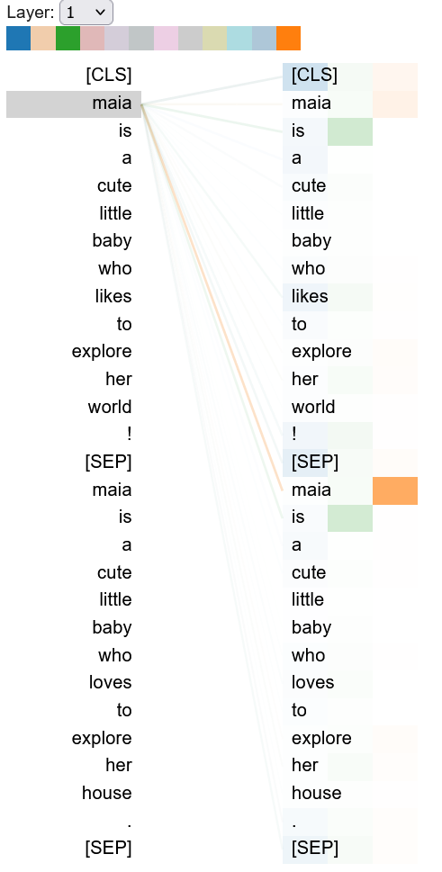
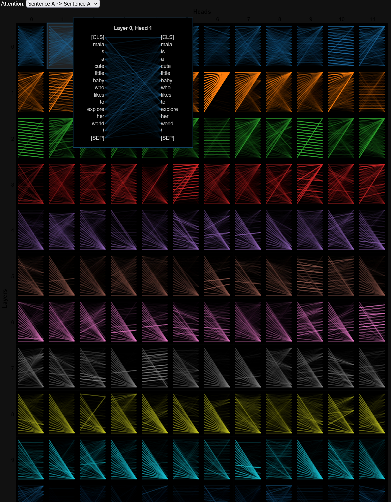

># A Look into the Black Box of Transformers
> **by Daniel K Baissa**


Transformer Models are often seen as black boxes, where it is not entirely clear how the models make their predictions. This has led to a field of research to develop tools to help us peer into these models and see how they come up with their outputs. In this post we will look at how to visualize the attention between tokens that transformer models assign. This should help researchers have a better understanding about the relationships their models find and the outcomes they produce.


Let's use the bert-base-uncased model.

## Step 1: Load the Model


```python
from transformers import BertModel
import torch

model_ckpt = 'bert-base-uncased'
do_lower_case = True
model = BertModel.from_pretrained(model_ckpt, output_attentions=True)
```

## Step 2: Load the Tokenizer


```python
from transformers import BertTokenizer


tokenizer = BertTokenizer.from_pretrained(model_ckpt, do_lower_case=do_lower_case)

text = "This is a test"
inputs = tokenizer(text, return_tensors="pt")
print(f"Input tensor shape is:{inputs['input_ids'].size()}")
```

    Input tensor shape is:torch.Size([1, 6])
    

## Step 3: Create a few simple sentances 


```python
sentence_a = "Maia is a cute little baby who likes to explore her world!"
sentence_b = "Maia is a cute little baby who loves to explore her house."
```

## Step 4: Tokenize the Sentances and get the Attention Masks


```python
inputs = tokenizer.encode_plus(sentence_a, sentence_b, return_tensors='pt', add_special_tokens=True)
token_type_ids = inputs['token_type_ids']
input_ids = inputs['input_ids']
attention = model(input_ids, token_type_ids=token_type_ids)[-1]
sentence_b_start = token_type_ids[0].tolist().index(1)
input_id_list = input_ids[0].tolist() # Batch index 0
tokens = tokenizer.convert_ids_to_tokens(input_id_list)
```

## Step 5: Visualize the Attention Masks

Let's start with head view from bertviz to visualize the attention layers one at a time.


```python
from bertviz import head_view,model_view

head_view(attention, tokens)
```


<div>
  
</div>

If you run this you should get something that looks like this, you can select the attention layers and visualize the attention relationships between tokens. You can hover over any token to visualize the attention to and from the token. The colors correspond to the attention heads, and you can double-click a color square at the top to filter the attention head of your choice. You can select the attention heads by single clicking on them. 

* The lines show the attention from each token (left) to every other token (right). Darker lines indicate higher attention weights. When multiple heads are selected, the attention weights are overlaid on one another.

### Model View
This is nice, but what if you wanted a higher level view? Seeing all attention relationships in all layers and heads at once?


```python
model_view(attention, tokens, sentence_b_start)
```

<div>
  
</div>


The layers are rows and heads are columns from the model. Remember *bert-base* has 12 layers and 12 heads (zero-indexed).

* **Click** on any **cell** for a detailed view of attention for the associated attention head.
* Then **hover** over any **token** on the left side of detail view to filter the attention from that token.
* The lines show the attention from each token (left) to every other token (right). Darker lines indicate higher attention weights.

Inspiration from: 
[Transformers for NLP and Computer Vision 3rd Edition](https://github.com/Denis2054/Transformers-for-NLP-and-Computer-Vision-3rd-Edition/tree/main)


I hope this was helpful!

Best,
Dan Baissa
