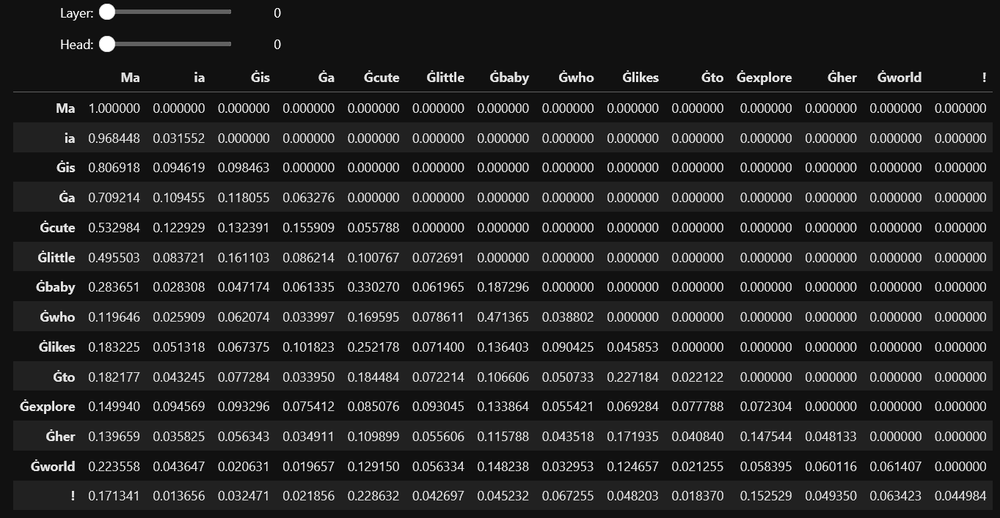

># A Peek into the Black Box of Transformers (Part 2)
> **by Daniel K Baissa**
 

Transformer models are often seen as black boxes, where it's not entirely clear how they make their predictions. However, by exploring the attention weights of these models, we can gain insights into how they process information. Here we will delve into the weights of a GPT model and demonstrate how to visualize and interpret these them.


### Input Text

Let's start by creating text that will be used by the model and tokenizer


```python
input_text = "Maia is a cute little baby who likes to explore her world!"
```

## Visualizing Attention Weights

Attention weights are a crucial component of transformer models. They allow the model to focus on different parts of the input sequence, helping it understand context and relationships between words.

Here's how to extract and visualize the attention weights:

### Loading the Model and Tokenizer

To work with the model, we'll also need to load the corresponding tokenizer. This allows us to convert input text into tokens that the model can process. GPT-2, like other models in the GPT family, does not output attention weights in a readily accessible manner using the `pipeline`. However, if you need to access attention weights, you can use the `GPT2Model` class directly from the `transformers` library. Here’s how you can modify the original code to work with GPT-2 and access its attention weights.


```python
from transformers import GPT2Tokenizer, GPT2Model
import torch

model_name = 'gpt2'
tokenizer = GPT2Tokenizer.from_pretrained(model_name)
model = GPT2Model.from_pretrained(model_name, output_attentions=True)
```

Next we will tokenize the input and extract the attention weights


```python
inputs = tokenizer.encode_plus(input_text, return_tensors='pt', add_special_tokens=True)
input_ids = inputs['input_ids']
attention_mask = inputs['attention_mask']
tokens = tokenizer.convert_ids_to_tokens(input_ids[0])

outputs = model(input_ids, attention_mask=attention_mask)
attentions = outputs.attentions
```

### Let's inspect the attention layers and heads


```python
num_layers = len(attentions)
num_heads = len(attentions[0][0])

print(f"Number of layers: {num_layers}")
print(f"Number of heads: {num_heads}")
```

    Number of layers: 12
    Number of heads: 12
    

Here, we can see that the GPT-2 model we used in our example has 12 layers and 12 heads. 

### Print Attention Values
Let's look at the raw data from the source token to the target tokes for the layers and heads. Well, let's look at 1 layer and head given that this would results in a list layer * head * tokens long


```python
target_head = 9
source_token_index = tokens.index('Ġexplore') # note explore is tokenized as Ġexplore
layer = 0  # Layer 1 in zero-based indexing
attention = attentions[layer]
head_attention = attention[0][target_head]  # Get the attention values for Head 10

print(f"Layer {layer + 1}:")
print(f"Head {target_head + 1}:")
print(f"Source token '{tokens[source_token_index]}' (index {source_token_index}):")
for target_token, attention_value in enumerate(head_attention[source_token_index]):
    print(f"Target token '{tokens[target_token]}' (index {target_token}): {attention_value.item()}")
```

    Layer 1:
    Head 10:
    Source token 'Ġexplore' (index 10):
    Target token 'Ma' (index 0): 0.1458146870136261
    Target token 'ia' (index 1): 0.05510123446583748
    Target token 'Ġis' (index 2): 0.11274424195289612
    Target token 'Ġa' (index 3): 0.09786500036716461
    Target token 'Ġcute' (index 4): 0.09351833909749985
    Target token 'Ġlittle' (index 5): 0.06825435161590576
    Target token 'Ġbaby' (index 6): 0.08472152054309845
    Target token 'Ġwho' (index 7): 0.10238094627857208
    Target token 'Ġlikes' (index 8): 0.09532036632299423
    Target token 'Ġto' (index 9): 0.10804509371519089
    Target token 'Ġexplore' (index 10): 0.0362342931330204
    Target token 'Ġher' (index 11): 0.0
    Target token 'Ġworld' (index 12): 0.0
    Target token '!' (index 13): 0.0
    

Here we can see the attention weights for explore in layer 1, head 10. We can see that the highest weights are for Ma, is, who, likes, and to. While it is obvious that the model needs many layers and heads to make sense of this, if I were to ask a person who likes to explore? They would guess that Ma(Maia) is who likes to (explore). Pretty neat.

### Displaying Attention Weights

To explore the attention weights interactively, we'll use widgets to select layers and heads, displaying the corresponding attention matrix. Sadly in this .md enviornment on Github I will have to just show an image of it. But if you run it at home, you should get an interactive table.


```python
import pandas as pd
import ipywidgets as widgets

# Create a DataFrame for each layer and head's attention matrix
df_layers_heads = []
for layer, attention in enumerate(attentions):
    for head, head_attention in enumerate(attention[0]):
        attention_matrix = head_attention[:len(tokens), :len(tokens)].detach().numpy()  # detach the tensor from gradients and convert to numpy
        df_attention = pd.DataFrame(attention_matrix, index=tokens, columns=tokens)
        df_layers_heads.append((layer, head, df_attention))

# Set the DataFrame display options for better visualization
pd.set_option('display.max_columns', None)
pd.set_option('display.expand_frame_repr', False)
pd.set_option('max_colwidth', None)

# Function to display the attention matrix
def display_attention(selected_layer, selected_head):
    _, _, df_to_display = next(df for df in df_layers_heads if df[0] == selected_layer and df[1] == selected_head)
    display(df_to_display)

# Create interactive widgets for the layer and head
layer_widget = widgets.IntSlider(min=0, max=len(attentions)-1, step=1, description='Layer:')
head_widget = widgets.IntSlider(min=0, max=len(attentions[0][0])-1, step=1, description='Head:')

# Use the widgets to interact with the function
widgets.interact(display_attention, selected_layer=layer_widget, selected_head=head_widget)
```

<div>
  
</div>


By visualizing the attention weights, we can demystify how transformer models process information. This exploration not only enhances our understanding of these models but also provides insights into their decision-making processes.

Transformers, while complex, are not entirely black boxes. By examining the attention masks, we can uncover the otherwise hidden relationships and patterns that drive their predictions.

I hope this was helpful!

Best,
Dan Baissa
