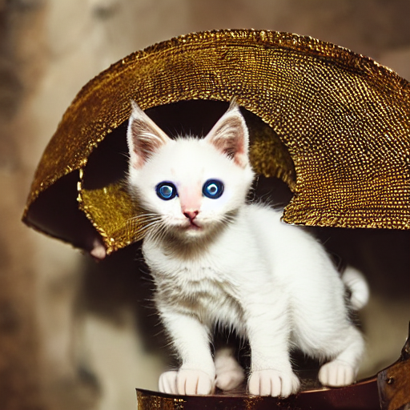
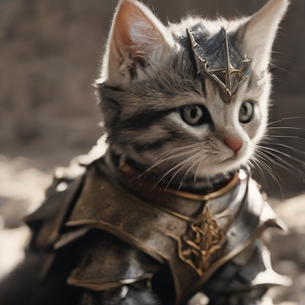
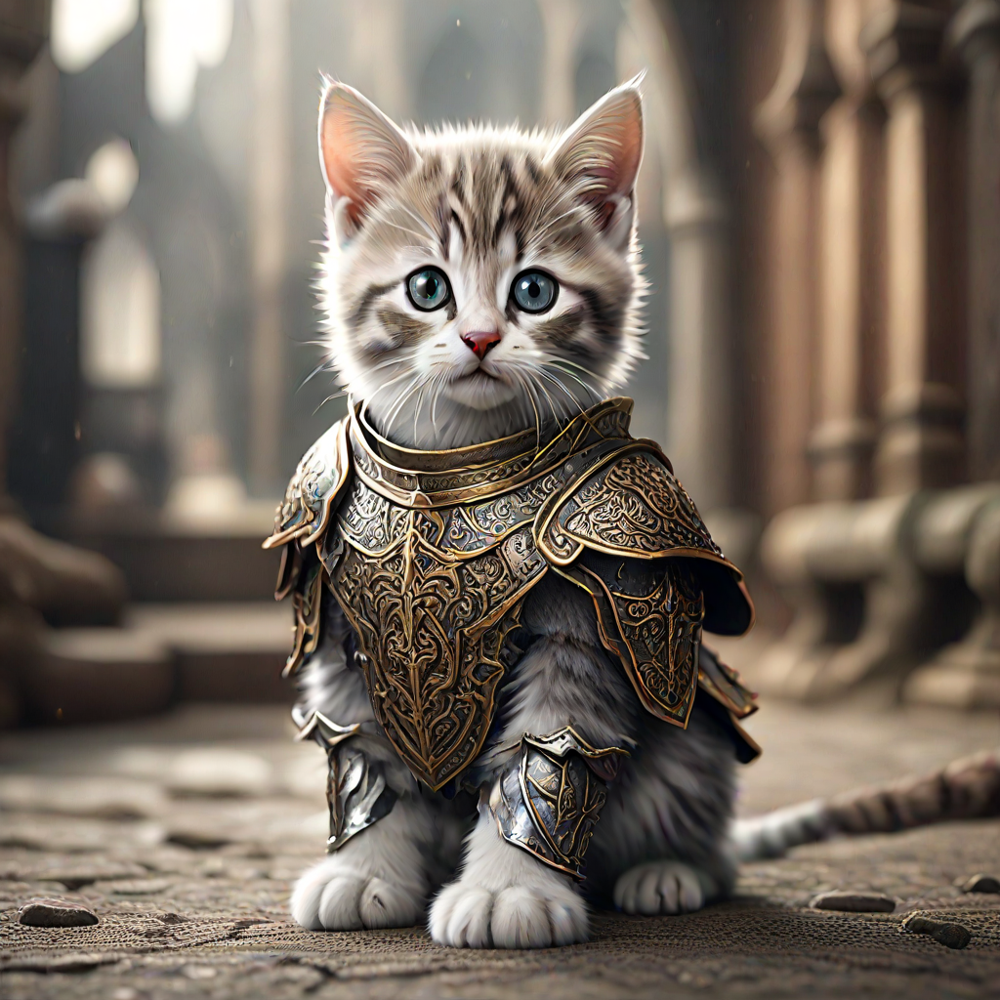
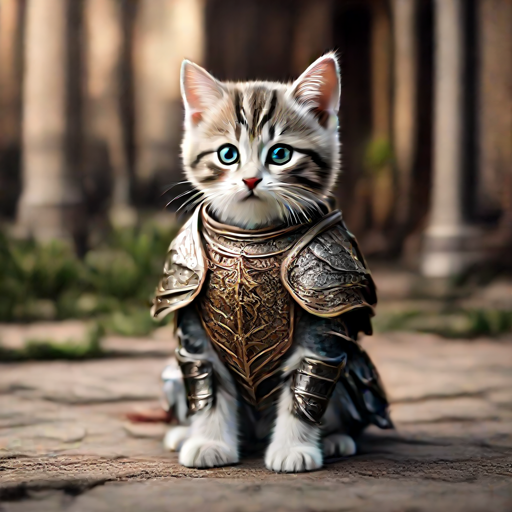
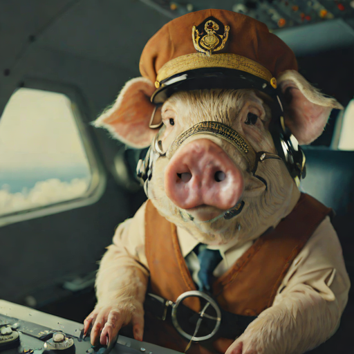

# Where NLP and image generation meet

Many people dream of being artists and have wonderful ideas for images, but going to art school takes a lot of time, 
especially if it is just going to be a hobby. Companies such as ad firms also may require large amounts of art that may 
take graphic designers hours or days to produce. Aka cost lots of money!

What if we could just tell an AI what image we want? What if we could just give it our crazy idea and have it generate 
it for us in seconds? Or perhaps hundreds of images in minutes? Maybe 
we could even produce thousands of images to train other AI models or simply to get that one perfect outlier image? 

Well, here we will do just that! Note: you will want a GPU for this!

## How does it work?

Ok, this all sounds too good to be true. How can you possibly write some words and have a model generate an image of 
something it has never seen before? 

[Remember that time ChatGPT "hallucinated" a bunch of legal 
citations?](https://www.forbes.com/sites/mollybohannon/2023/06/08/lawyer-used-chatgpt-in-court-and-cited-fake-cases-a-judge-is-considering-sanctions/?sh=4490d9e07c7f)
What if we could use those hallucinations for good? 

Let's take upscaling using Super Resolution. There are a finite number of pixels in the image, and we want to add more. 
What can we do? We can make up the pixel values in between with a realistic-looking hallucination, and now we have an 
image that looks exactly like the real thing, only at a higher resolution!

Ok, so that seems reasonable. It is just extrapolating between pixel values, denoising the image. But what if we tried to
denoise ***pure*** noise? Well, then the hallucination will be driving the result, creating a new image 
based on your text! 

I will eventually create a more detailed description of how diffusion models work, but for now this 
[tutorial](https://keras.io/examples/generative/ddim/) describes it well if you want more detail.

## Making Images from Text

The first step in converting text to images is creating some text. Let's make a silly prompt about a kitten wearing 
fancy armor!

```python
prompt = "A cinematic shot of a kitten wearing an intricate italian knight's armor."
```

Now, we will just have to feed the prompt into the diffusion models to get our images. Here, I will try a couple of 
diffusion models from early versions to more modern versions of Stable Diffusion

### Stable Diffusion v1.4

Let's start with 1.4. Stable Diffusion has come a long way since 1.4, but it should give us an idea of how far this 
technology has come. This model is from all the way back in 2022.

```python
from diffusers import StableDiffusionPipeline
import torch

# Load the pipeline (model and tokenizer)
pipeline = StableDiffusionPipeline.from_pretrained("CompVis/stable-diffusion-v1-4", torch_dtype=torch.float16, use_safetensors=True).to("cuda")


image = pipeline(prompt=prompt).images[0]

# Save the image
image_path = "generated_image.png"
image.save(image_path)
```




Well, it's a cat with some strange looking eyes. What more can I say? It's not great. This is probably what you might have expected if you were skeptical
of the technology. 

### SDXL Turbo

So the model from 2022 article was a bit underwhelming. How much improvement can we expect in 1 year?

```python
from diffusers import AutoPipelineForText2Image
import torch

pipe = AutoPipelineForText2Image.from_pretrained("stabilityai/sdxl-turbo", torch_dtype=torch.float16, variant="fp16")
pipe.to("cuda")

image = pipe(prompt=prompt, num_inference_steps=1, guidance_scale=0.0).images[0].save("sdxl-turbo.png")

```




Well, that is actually very impressive! Remember, there is no cat here. This started as a bunch of noise and turned into
this image of a kitten wearing armor. I would say that this is a large improvement over 1.4.

### Hyper SD

Remember, we can take an existing model and finetune them enhacing their abilities. In this case I will use the Hyper SD
model generated by ByteDance from 2024

```python
import torch
from diffusers import DiffusionPipeline, DDIMScheduler
from huggingface_hub import hf_hub_download
base_model_id = "stabilityai/stable-diffusion-xl-base-1.0"
repo_name = "ByteDance/Hyper-SD"
# Take 2-steps lora as an example
ckpt_name = "Hyper-SDXL-2steps-lora.safetensors"
# Load model.
pipe = DiffusionPipeline.from_pretrained(base_model_id, torch_dtype=torch.float16, variant="fp16").to("cuda")
pipe.load_lora_weights(hf_hub_download(repo_name, ckpt_name))
pipe.fuse_lora()
# Ensure ddim scheduler timestep spacing set as trailing !!!
pipe.scheduler = DDIMScheduler.from_config(pipe.scheduler.config, timestep_spacing="trailing")
# lower eta results in more detail

image=pipe(prompt=prompt, num_inference_steps=2, guidance_scale=0).images[0].save("HyperSD.png")

```




Ok now this is really impressive. It is obviously not perfect, but it is really good and we can see how far the 
technology has come in just 2 years!

### Hyper SD 1 Step Version

Let's try their one step version of their model

```python
import torch
from diffusers import DiffusionPipeline, TCDScheduler
from huggingface_hub import hf_hub_download
base_model_id = "stabilityai/stable-diffusion-xl-base-1.0"
repo_name = "ByteDance/Hyper-SD"
ckpt_name = "Hyper-SDXL-1step-lora.safetensors"
# Load model.
pipe = DiffusionPipeline.from_pretrained(base_model_id, torch_dtype=torch.float16, variant="fp16").to("cuda")
pipe.load_lora_weights(hf_hub_download(repo_name, ckpt_name))
pipe.fuse_lora()
# Use TCD scheduler to achieve better image quality
pipe.scheduler = TCDScheduler.from_config(pipe.scheduler.config)
# Lower eta results in more detail for multi-steps inference
eta=1.0

image=pipe(prompt=prompt, num_inference_steps=1, guidance_scale=0, eta=eta).images[0].save("HyperSD2.png")

```




The eyes are imperfect but again not bad! It is amazing that these kinds of models are avaiable to anyone who can use 
Python and has access to a GPT, not to mention Automatic1111!

So the next time someone tells you that deepfakes are decades off and there is nothing to be worried about, you can 
simply say "when pigs fly" and show them this!



I hope this page was useful! Next I will create a page where we take one of these images for image-to-text processing.

Thank you!
Dan Baissa